# Guía 2.1. Restricciones e Integridad  — Mapeo composición y agregación

**UTN - FRP - TUP - Programación aplicada 2026 - Acceso a datos - SQL Server**

[Home](https://docs.google.com/document/d/1fU7NQupaFc95iPifZDb__KNbMF07a2dEiJU1Emimv0g/preview) / [Aplicada 2026](https://docs.google.com/document/d/1o-iFNkw3PyW0xb7arr3JwQXRaZ_FKOh6MO4sC_dAR5g/preview)

**Referencias**

[Resumen - SQL](https://docs.google.com/document/d/1YUcfk7-wwUuEuzN6An1Ssg9_oDme_Xuj/preview)

  > «No hay una forma de hacer las cosa, pero se debe
  > contar con una que se condiga con la realidad».

- **fork**: <https://github.com/UTN-FRP-TUP-Aplicada-2026/tup_aplicada_2026_guia2.1>
- **sol**: <https://github.com/fernandofilipuzzi-dev/tup_aplicada_2026_guia2.1>

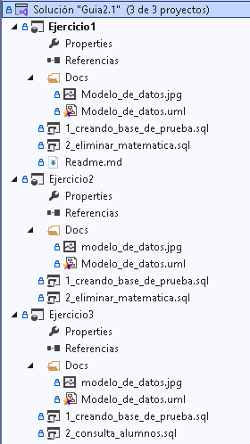

*Figura 1. Estructura de la solución*

---

## Índice

- **[Introducción](#introducción)**
- **[Ejercicio 1. Curso-Alumno. Agregación](#ejercicio-1-curso-alumno-agregación)**
- **[Ejercicio 2. Curso-Alumno. Composición](#ejercicio-2-curso-alumno-composición)**
- **[Ejercicio 3. Alumno-Domicilio-Localidad - Composición y agregación](#ejercicio-3-alumno-domicilio-localidad---composición-y-agregación)**
- **[Nota de la exportación](#nota-de-la-exportación)**

---

## Introducción

Los siguientes ejercicios tratan algunos casos que me tocaron codificar hace tiempo. El trabajo consistió en codificar las clases junto con las reglas del mapeador del modelo de objetos a relacional (ORM) dados los diagramas UML. Las reglas del ORM consisten en las restricciones de si se permite nulos, el borrado en cascada, la cardinalidad, referencias, que propiedades se mapean, etc.

Así que para poder asegurarme de que el mapeador generase el DDL correcto construí en su momento un conjunto de datos que fuese coherente con el modelo orientado objeto propuesto por el diseñador.

Luego con ese conjunto de datos válidos me permitió entender fácilmente las relaciones que me debía esperar resultante del ORM, por ejemplo si se necesitaba una tabla relacional para vincular dos o más tablas, si se necesitaba incluir el borrado en cascada en las claves foráneas, o en que tabla ubicar la id foranea. Pero en todos los casos partí del modelo orientado a objetos y mediante el significado particular de cada uno de los tipos de relación entre entidades (composición, agregación o herencia) armaba ese conjunto de datos.

Así es que después que se generaba el DDL verificaba que el modelo resultante sea compatible y coherente con ese conjunto de datos. De esta manera me aseguraba que los datos que vayan y vengan entre los dos modelos no se vuelvan inconsistentes.

> 
>
> Los datos reales no deben falsearse para que se ajusten al modelo sino que el modelo debe ajustarse para que representen lo mejor posible a esos datos. Así, con esto, con un modelo ya establecido también se pueden determinar un conjunto de valores válidos a ese modelo y fieles al sistema que representa.
>

---

## Ejercicio 1. Curso-Alumno. Agregación

Se tiene en la Figura 1.1 las siguiente clases relacionadas que representan el modelo de datos

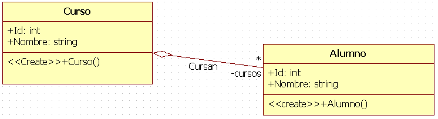

*Figura 1.1. Modelo de datos del dominio.*

Podemos plantear las tablas equivalentes para dicho modelo de datos.

| (a) | (b) | (c) |
| :-: | :-: | :-: |
|  | 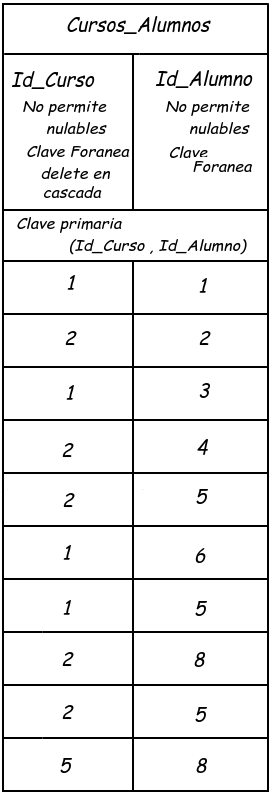 | 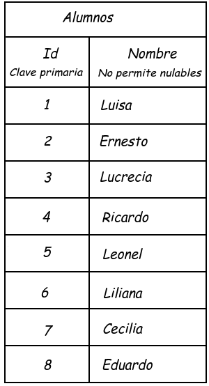 |

*Figura 1.2 La relación entre curso y alumno es de muchos cursos a muchos alumnos. (a) Tabla cursos. (b) Tabla relacional. (c) Tabla alumnos*

<b>Transcripción de la Figura 1.2</b> — el contenido de las tres imágenes, en texto

**(a) `Cursos`** — `Id`: clave primaria · `Nombre`: no permite nulables

| Id | Nombre |
| --- | --- |
| 1 | Matemática |
| 2 | Programación |
| 3 | Literatura |
| 4 | Mecánica Aplicada |
| 5 | Cocina |
| 6 | Carpintería |
| 7 | Reparación de PC |
| 8 | Instalación Eléctricas Domiciliarias |

**(b) `Cursos_Alumnos`** — clave primaria `(Id_Curso, Id_Alumno)` · `Id_Curso`: no permite nulables, clave foránea **delete en cascada** · `Id_Alumno`: no permite nulables, clave foránea

| Id_Curso | Id_Alumno |
| --- | --- |
| 1 | 1 |
| 2 | 2 |
| 1 | 3 |
| 2 | 4 |
| 2 | 5 |
| 1 | 6 |
| 1 | 5 |
| 2 | 8 |
| 2 | 5 |
| 5 | 8 |

**(c) `Alumnos`** — `Id`: clave primaria · `Nombre`: no permite nulables

| Id | Nombre |
| --- | --- |
| 1 | Luisa |
| 2 | Ernesto |
| 3 | Lucrecia |
| 4 | Ricardo |
| 5 | Leonel |
| 6 | Liliana |
| 7 | Cecilia |
| 8 | Eduardo |

En este punto planteaba en la práctica laboral premisas que me permitiera saber si iba bien.

  > **Cardinalidad**
  >
  > En este modelo hay una relación de muchos a muchos, mis premisas aquí serían:
  >
  > Se tiene que al curso de Matemática (uno) van: Luisa, Lucrecia, LiLiana y Leonel (Muchos).
  >
  > Pero el mismo Leonel (**uno**) va a Matemática y Programación (**muchos** cursos).
  > Así tenemos:
  > 
  > - En **un** curso en particular hay **muchos** alumnos.
  > - En **muchos** cursos hay **un** alumno en particular.
  > 
  > Por lo tanto deducimos que:
  >
  > - **Muchos a muchos.**
  > De ahí que acá se necesita una **tabla relacional** que vincule las diferentes relaciones entre las entidades de ambas tablas.

  > **Agregación**
  >
  > Mi premisa aquí viene no del conjunto de datos sino del modelo propuesto, el modelo propone una agregación entonces:
  > 
  > - Una **"Parte"** puede ser agregada a más de un **"Todo"**.
  >
  > Tomando las premisas realizadas para entender la cardinalidad entre las relaciones para que sean compatibles entre estas tendríamos garantizado que ambos modelos son lo correcto según los datos propuestos.
  > 
  > La única restricción que hay que garantizar en la tabla referencial es que no se dupliquen las relaciones de entre tablas, Por ejemplo: que Leonel no esté dos veces inscripto a matemáticas.

### Actividades

  1. Realizar el script que cree la **base de datos**, las **tablas**, las **restricciones**, las **inserciones** de los datos dados en la Figura 1.2. (`1_creando_base_de_prueba.sql`)

  2. Realizar otro script en el que se elimine el Curso Matemáticas. Con las restricciones referenciales con delete en cascada debería borrar todas las filas de la tabla relacional referentes al curso de matemática (todos las inscripciones a matemática **sin borrar los alumnos asociados a matemática**). Antes y luego de eliminar hacer la consulta de los alumnos con un left join a la tabla cursos. (`2_delete_matematica.sql`)

  

  *Figura 1.3. Consulta de los alumnos antes y después de borrar el curso matemáticas*

  En la Figura 1.3 se ven las consultas antes y después, al eliminarse matemática, los alumnos que cursaban solo matemática quedaron sin curso asignado.

---

## Ejercicio 2. Curso-Alumno. Composición

  Se tiene en la Figura 2.1 las siguiente clases relacionadas que representan el modelo de datos

  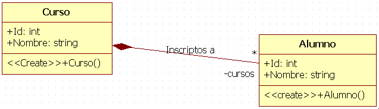

  *Figura 2.1. Modelo de datos del dominio.*

  Podemos plantear las tablas equivalentes para dicho modelo de datos.

| (a) | (b) |
| :-: | :-: |
| 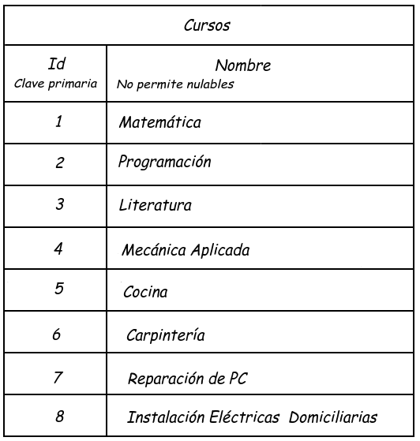 | 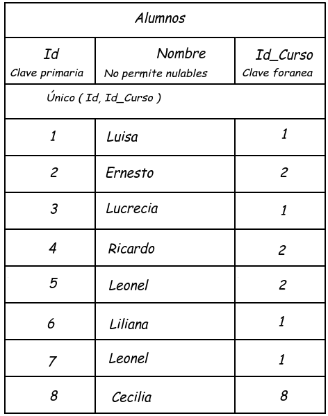 |

  *Figura 2.2. Relación un curso a muchos alumnos. (a) Tabla Cursos. (b) Tabla alumnos.*

  

  
<b>Transcripción de la Figura 2.2</b> — el contenido de las dos imágenes, en texto

  **(a) `Cursos`** — `Id`: clave primaria · `Nombre`: no permite nulables. *(Los mismos ocho cursos de la Figura 1.2a.)*

| Id | Nombre |
| --- | --- |
| 1 | Matemática |
| 2 | Programación |
| 3 | Literatura |
| 4 | Mecánica Aplicada |
| 5 | Cocina |
| 6 | Carpintería |
| 7 | Reparación de PC |
| 8 | Instalación Eléctricas Domiciliarias |

**(b) `Alumnos`** — `Id`: clave primaria · `Nombre`: no permite nulables · `Id_Curso`: clave foránea · **Único `(Id, Id_Curso)`**

| Id | Nombre | Id_Curso |
| --- | --- | --- |
| 1 | Luisa | 1 |
| 2 | Ernesto | 2 |
| 3 | Lucrecia | 1 |
| 4 | Ricardo | 2 |
| 5 | Leonel | 2 |
| 6 | Liliana | 1 |
| 7 | Leonel | 1 |
| 8 | Cecilia | 8 |

  De la misma forma que en el ejercicio anterior, aquí planteo algunas premisas que me permitiera saber si voy bien.

  > **Cardinalidad**
  >
  > ***En este modelo hay una relación de uno a muchos:***
  >
  > ***Se tiene que al curso de Matemática (uno) van Luisa, Lucrecia, LiLiana y Leonel (muchos).***
  > 
  > ***Pero, el Leonel que va a "Reparación de PC" (uno), no es el mismo Leonel que el que va al curso de Matemática.***
  > 
  > ***Ambos tienen diferente ID, por lo tanto aunque la persona puede que sea la misma, la figura de alumno aquí representa más la inscripción. Así que el modelo de Alumno podría llamarse `InscripcionAlumno`.***
  >
  > ***Así tenemos:***
  >
  >  - ***En un curso hay muchos alumnos.***
  >  - ***Un alumno (inscripción) en un curso.***
  >
  > ***Por lo tanto:***
  >
  > - **Muchos a uno.**
  >
  > ***Así que tenemos que de la tabla de alumno, por cada alumno tenemos que tener una referencia hacia alguna de las entidades del Curso.***

  > **Composición**
  >
  > ***No hay un mismo objeto "Parte" que componga dos o más "Todos". Esta premisa se logra en parte mediante las restricciones de unicidad del par Id de alumno con la Id de referencia al curso.***
  >
  > ***La otra parte es asegurarse que no haya una Parte "Alumno" sin curso. Sino sería como tener una inscripción sin alumno. Con agregar una restricción de no permitir nulables en la id de referencia a curso en la Tabla Alumnos.***
  >
  > ***También, para asegurarse de lo dicho en el párrafo anterior es necesario cubrir el caso de que se borre un curso, automáticamente se deberían borrar los alumnos asociados. Esto se logra agregando en la integridad referencial el delete en cascada.***
  >

  > 
  >
  > ***A diferencia de lo visto en el modelo con agregación, "El alumno" aquí representa una inscripción antes los ojos del observador.***

### Actividades

  1. Realizar el script que cree la **base de datos**, las **tablas**, las **restricciones**, la **inserción** de los datos dados en la Figura 2.2. (`1_creando_base_de_prueba.sql`)
  
  2. Realizar otro script que borre el Curso Matemáticas, con las restricciones en cascada debería borrar también los alumnos relacionados a ese curso. Realizar la consulta de la tabla alumnos junto al curso antes y después del borrado del curso. (`2_delete_matematica.sql`)

  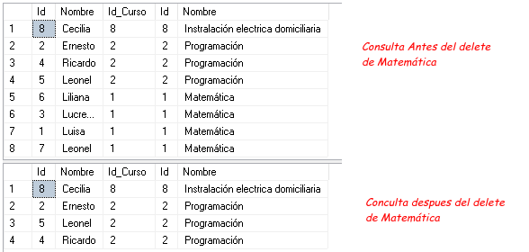

  *Figura 2.3. Consulta de los alumnos antes y después de borrar el curso matemáticas*

  > 
  >
  > En la Figura 2.3, se observa que al borrar el "Todo" se borraron las partes también.

---

## Ejercicio 3. Alumno-Domicilio-Localidad - Composición y agregación

  Se tiene en la Figura 3.1 las siguiente clases relacionadas que representan el modelo de datos

  

  *Figura 3.1. Modelo de datos del dominio.*

  Podemos plantear las tablas equivalentes para dicho modelo de datos.

  **(a)**

  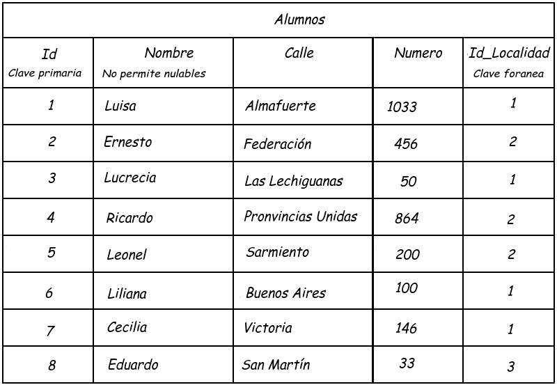

  **(b)**

  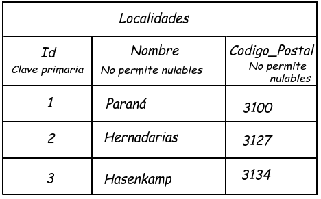

  *Figura 3.2. Relación de un alumno a un domicilio. (a) Tabla Alumnos. (b) Tabla localidades.*

  

  
<b>Transcripción de la Figura 3.2</b> — el contenido de las dos imágenes, en texto

  **(a) `Alumnos`** — `Id`: clave primaria · `Nombre`: no permite nulables · `Id_Localidad`: clave foránea

| Id | Nombre | Calle | Numero | Id_Localidad |
| --- | --- | --- | --- | --- |
| 1 | Luisa | Almafuerte | 1033 | 1 |
| 2 | Ernesto | Federación | 456 | 2 |
| 3 | Lucrecia | Las Lechiguanas | 50 | 1 |
| 4 | Ricardo | Pronvincias Unidas | 864 | 2 |
| 5 | Leonel | Sarmiento | 200 | 2 |
| 6 | Liliana | Buenos Aires | 100 | 1 |
| 7 | Cecilia | Victoria | 146 | 1 |
| 8 | Eduardo | San Martín | 33 | 3 |

**(b) `Localidades`** — `Id`: clave primaria · `Nombre`: no permite nulables · `Codigo_Postal`: no permite nulables

| Id | Nombre | Codigo_Postal |
| --- | --- | --- |
| 1 | Paraná | 3100 |
| 2 | Hernadarias | 3127 |
| 3 | Hasenkamp | 3134 |

Planteo de premisas y conceptos:

### Cardinalidad, composición y agregación

Cada alumno tiene su propio domicilio, no cabe la posibilidad de que esa entidad se comparta con otro. Puede que otro alumno tenga otro domicilio con los mismos datos, pero no misma entidad.

Con eso tenemos que no queremos dejar la posibilidad de que quede un domicilio sin alumno. Por lo al ser uno a uno la relación podemos contemplar los atributos del domicilio en la misma tabla de alumnos.

Lo referente a las localidades, es simplemente una agregación a domicilio, el domicilio exige si o si un domicilio. Con una restricción de no permitir nulos en la referencia hacia la tabla de localidades en la tabla de alumnos va a bastar.

### Actividades

  1. Realizar el script que cree la base de datos, las tablas, las restricciones, la inserción de los datos dados en la Figura 3.2. (`1_creando_base_de_prueba.sql`)
  2. Listar todos los alumnos con su domicilio correspondiente. (`2_consulta_alumnos.sql`)

  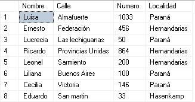

   *Figura 3.3. Consulta final de los alumnos.*

---

Filipuzzi, Fernando -

---

## Nota de la exportación

*Esta sección no pertenece al documento original. Registra cómo se produjo esta copia y qué se observó al hacerla.*

### Cómo se hizo

| Paso | Cómo |
| --- | --- |
| Origen | [Documento de Google Drive](https://docs.google.com/document/d/1Wjnpf8ePnEhgrUPCFvDrfDwI5O7qO7E6/preview), exportado el 2026-09-05 |
| Texto | Exportación a `.docx` y lectura del `word/document.xml`, cotejada con la lectura del documento por el conector de Drive |
| Imágenes | Extraídas de `word/media/` del mismo `.docx` — son los archivos originales, no capturas de pantalla |
| Índice | Recreado con enlaces internos; el original tenía números de página, que no aplican en markdown |
| Transcripciones | Las tablas de las figuras 1.2, 2.2 y 3.2 están además transcriptas en texto, leyendo cada imagen |

