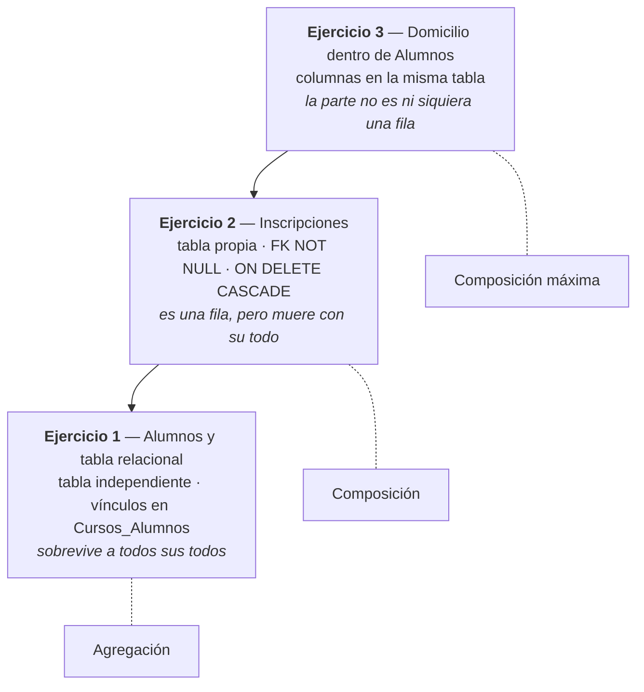

# Composición y agregación en el modelo relacional

> **De qué se trata**: de una sola pregunta —*¿cómo se escribe en tablas que una cosa es **parte de** otra?*— y de la respuesta incómoda: **no se escribe**. El modelo relacional no tiene composición ni agregación. Tiene claves foráneas, y tres decisiones alrededor de cada una.
>
> **La tesis**: esas tres decisiones alcanzan para que el esquema **se comporte** como el modelo de objetos dice que debe comportarse, y por eso **elegir entre composición y agregación es, del lado relacional, una decisión de integridad referencial**. Queda un resto que no se puede mapear, y la §8 lo declara en vez de disimularlo.
>
> **Dónde encaja**: el apunte [Restricciones-Integridad.md](Restricciones-Integridad.md) explica el mecanismo —qué hace una `FOREIGN KEY`, qué hace `ON DELETE`— **sin salir del vocabulario relacional**. Este documento es el puente, y es el único de los dos donde el modelo de objetos es un punto de partida legítimo. La práctica está en la [Guía 2.1](Guia2.1/Guia2.1.Restricciones-Integridad.md), de donde salen todos los ejemplos.
>
> **Y hacia dónde va**: mapear a mano es lo que después hace una herramienta. Todo lo que acá se decide leyendo un diagrama y escribiendo un `CREATE TABLE` es, más adelante, lo que un mapeador objeto-relacional genera solo. **Este documento no habla de ninguna herramienta en particular** — pero deja escrito qué es lo que una herramienta así tiene que decidir, que es la única forma de después poder juzgarla.
>
> **Qué se afirma y con qué**: las citas de comportamiento del motor son de la documentación de Microsoft; las definiciones de restricción, de Elmasri & Navathe. Los datos y las figuras son de la Guía 2.1. **Lo que este documento agrega —el marco de las tres decisiones y la escala de la §5— es razonamiento propio**, y está marcado como tal. Nada se ejecutó contra un SQL Server.

---

## Índice

- **[1. Definiciones](#1-definiciones)** — todo, parte, agregación, composición, dependencia de existencia
- **[2. El mismo modelo, en objetos](#2-el-mismo-modelo-en-objetos)** — las mismas dos clases escritas dos veces, y la asimetría que gobierna todo el mapeo
- **[3. Por qué esto es un problema de integridad referencial](#3-por-qué-esto-es-un-problema-de-integridad-referencial)** — qué se mapea cuando no hay nada que traducir
- **[4. Las tres decisiones detrás de una clave foránea](#4-las-tres-decisiones-detrás-de-una-clave-foránea)** — dónde vive, si admite nulo, qué pasa al borrar. **Es el núcleo**
- **[5. La escala de existencia propia](#5-la-escala-de-existencia-propia)** — los tres ejercicios de la guía, ordenados
- **[6. La prueba con datos](#6-la-prueba-con-datos)** — cómo se comprueba un mapeo, y los dos Leonel
- **[7. Lo que este marco hace visible](#7-lo-que-este-marco-hace-visible)** — tres cosas que sin él pasan desapercibidas
- **[8. Lo que no se puede mapear](#8-lo-que-no-se-puede-mapear)**
- **[9. Lo que este documento no cubre](#9-lo-que-este-documento-no-cubre)**
- **[10. El criterio, en una línea](#10-el-criterio-en-una-línea)**

---

## 1. Definiciones

Se declaran. Las tres primeras vienen del modelo de objetos; la cuarta es la que permite hablar de lo mismo sin salir del relacional.

> **Todo** y **parte** — los dos extremos de una relación en la que uno de los dos se entiende *como componente del otro*. En las tablas, el **todo** es la fila referenciada y la **parte** es la fila que referencia.
>
> **Agregación** — la parte se asocia al todo, pero existe por su cuenta: puede pertenecer a varios todos, y sobrevive a la desaparición de cualquiera de ellos. En UML, rombo **blanco**.
>
> **Composición** — la parte pertenece a un único todo y no existe sin él: si el todo se destruye, la parte se destruye. En UML, rombo **relleno**.
>
> **Dependencia de existencia** — el nombre relacional del mismo fenómeno: **filas cuya existencia está subordinada a filas de otra tabla.** Es lo único de la composición que el esquema puede realmente declarar.

**Por qué hace falta el cuarto término:** porque «composición» describe una intención del diseñador, y «dependencia de existencia» describe un comportamiento de las filas. **El mapeo es el pasaje de lo primero a lo segundo**, y sin dos palabras distintas no se puede decir cuándo el pasaje salió bien.

---

## 2. El mismo modelo, en objetos

### 2.1 ¿Cómo se ve la diferencia en el modelo de objetos?

**Respuesta: en quién construye la parte, y en quién puede quedarse con ella.**

Las mismas dos clases, escritas dos veces. En C# clásico, sin azúcar sintáctica, para que se vea el mecanismo y no el atajo.

**Agregación — la parte entra desde afuera:**

```csharp
public class Alumno
{
    private int id;
    private string nombre;

    public Alumno(int id, string nombre)     // cualquiera lo construye
    {
        this.id = id;
        this.nombre = nombre;
    }

    public int Id { get { return this.id; } }
    public string Nombre { get { return this.nombre; } }
}

public class Curso
{
    private int id;
    private string nombre;
    private List<Alumno> alumnos;

    public Curso(int id, string nombre)
    {
        this.id = id;
        this.nombre = nombre;
        this.alumnos = new List<Alumno>();
    }

    public void Agregar(Alumno alumno)       // la parte llega ya creada
    {
        this.alumnos.Add(alumno);
    }
}
```

```csharp
Alumno leonel = new Alumno(5, "Leonel");
matematica.Agregar(leonel);
programacion.Agregar(leonel);                // el MISMO objeto, en dos cursos
```

**Composición — la parte nace adentro:**

```csharp
public class Inscripcion
{
    private int id;
    private string nombre;

    internal Inscripcion(int id, string nombre)   // solo el Curso la construye
    {
        this.id = id;
        this.nombre = nombre;
    }

    public int Id { get { return this.id; } }
    public string Nombre { get { return this.nombre; } }
}

public class Curso
{
    private int id;
    private string nombre;
    private List<Inscripcion> inscripciones;

    public Curso(int id, string nombre)
    {
        this.id = id;
        this.nombre = nombre;
        this.inscripciones = new List<Inscripcion>();
    }

    public Inscripcion Inscribir(int id, string nombre)   // la parte nace acá
    {
        Inscripcion inscripcion = new Inscripcion(id, nombre);
        this.inscripciones.Add(inscripcion);
        return inscripcion;
    }
}
```

```csharp
matematica.Inscribir(7, "Leonel");
programacion.Inscribir(5, "Leonel");         // DOS objetos distintos, mismo nombre
```

**No cambió ni un atributo.** Cambió quién tiene el constructor, y con eso cambió todo lo demás:

| | Agregación | Composición |
| --- | --- | --- |
| **Quién construye la parte** | Alguien de afuera | El todo |
| **¿Puede estar en dos todos?** | Sí — es el mismo objeto, referenciado dos veces | No — nadie de afuera puede construirla ni pasarla |
| **Al destruirse el todo** | La parte sigue viva: alguien más la referencia | Nadie la referencia: se va con él |

**Los dos Leonel de la §6 ya están acá**, antes de que aparezca una tabla: en la agregación es **un** objeto en dos listas; en la composición son **dos** objetos que solo comparten el nombre.

### 2.2 ¿Cuál de esas tres diferencias sobrevive al pasaje a tablas?

**Respuesta: las dos primeras se escriben. La tercera hay que ordenarla, porque en las tablas nada se muere solo.**

Y esa es la asimetría que gobierna todo el mapeo:

| | En objetos | En tablas |
| --- | --- | --- |
| **Exclusividad** | El constructor privado la impone | La impone la forma de la tabla (§4.1) |
| **Obligatoriedad** | La parte nace con su todo, no puede no tenerlo | `NOT NULL` (§4.2) |
| **Destrucción** | **Automática**: nadie la referencia, el recolector se la lleva | **Nada.** Una fila sobrevive hasta que alguien la borra |

En el modelo de objetos la parte muere **porque dejó de ser alcanzable**, y eso no lo escribió nadie: es una propiedad del entorno de ejecución. **En el modelo relacional no hay alcanzabilidad ni recolector**: una fila huérfana se queda ahí, correcta y sin sentido, para siempre.

> **`ON DELETE CASCADE` es la cláusula que ocupa el lugar del recolector.**

| | |
| --- | --- |
| ✅ | «En objetos la destrucción se deduce; en tablas se declara» |
| ❌ | «`ON DELETE CASCADE` es el equivalente del destructor» — el destructor limpia lo que ya murió; la cascada **decide** que muera |

**Y de acá sale la razón por la que existen los mapeadores.** Nada de lo anterior es automático: alguien tiene que mirar el modelo de objetos y decidir tres cláusulas por cada relación. Cuando ese alguien es una herramienta y no una persona, la herramienta necesita que el modelo de objetos diga explícitamente qué relación es cada una — porque **de las clases solas no se deduce**. Un `List<Alumno>` se ve igual en los dos casos; la diferencia estaba en el constructor, que ninguna herramienta lee como intención.

---

## 3. Por qué esto es un problema de integridad referencial

### 3.1 ¿Qué tiene el modelo relacional para expresar «es parte de»?

**Respuesta: nada. Tiene una clave foránea, que solo sabe decir «este valor existe allá».**

No hay palabra reservada `COMPOSICION`, ni un tipo de relación que se declare. Una `FOREIGN KEY` afirma una cosa y solo una: que el valor referenciado existe. Que además ese valor sea *el dueño* de la fila que lo referencia, la cláusula no lo dice.

| | |
| --- | --- |
| ✅ | «La clave foránea garantiza que la localidad referenciada exista» |
| ❌ | «La clave foránea expresa que la persona pertenece a la localidad» |

### 3.2 Entonces, ¿qué se mapea?

**Respuesta: el comportamiento, no el concepto.**

No se traduce «composición» a ninguna palabra. Se elige un conjunto de decisiones tal que **el esquema haga lo que el modelo de objetos promete**: que la parte no pueda existir sin todo, que no pueda estar en dos, y que muera con él.

**Y el criterio de éxito es el de la propia Guía 2.1**, que lo enuncia en su introducción: construir primero un conjunto de datos coherente con el modelo de objetos y después comprobar que el DDL **lo admite y no admite otra cosa**. El mapeo no se verifica leyendo el `CREATE TABLE`: se verifica intentando romperlo.

### 3.3 ¿Por qué decir que es una decisión de integridad referencial?

**Respuesta: porque las tres decisiones que hacen la diferencia cuelgan todas de la clave foránea.**

Dónde se la declara, si admite nulos, y qué hace cuando se borra lo referenciado. Nada más. **Composición y agregación no se distinguen por las columnas ni por los datos: se distinguen por cómo está configurada una clave foránea** — y eso es, exactamente, integridad referencial.

---

## 4. Las tres decisiones detrás de una clave foránea

Es el núcleo del documento. Las tres son independientes entre sí, y cada una responde a una afirmación distinta del modelo de objetos.

### 4.1 ¿Dónde vive la clave foránea?

**Respuesta: donde viva decide si la exclusividad hay que declararla o viene gratis.**

Hay dos formas de vincular dos tablas, y no son equivalentes:

| Forma | Cuántos todos puede tener una parte |
| --- | --- |
| **Columna en la tabla de la parte** — `Alumnos.Id_Curso` | **Uno**, porque una columna guarda un valor |
| **Tabla relacional aparte** — `Cursos_Alumnos` | **Varios**, porque se agregan filas |

**La exclusividad de la composición no la da ninguna restricción: la da la forma de la tabla.** Si la clave foránea es una sola columna dentro de la parte, no hay manera de escribir que una parte pertenezca a dos todos. No hay nada que declarar y nada que verificar.

Con tabla relacional pasa lo contrario: la estructura *permite* varios todos, y prohibirlo exige un `UNIQUE` sobre la columna de la parte **sola** —no sobre el par—. Sobre las mismas dos columnas:

| Restricción | Qué impide | Qué relación describe |
| --- | --- | --- |
| `PRIMARY KEY (Id_Curso, Id_Alumno)` | Repetir **el mismo** vínculo | **Agregación** |
| `UNIQUE (Id_Alumno)` | Un **segundo** vínculo | **Composición** |

**Pero la tabla relacional tiene un techo, y es el que decide la elección:** ahí el borrado nunca alcanza a la parte (§4.3). Por eso, **si la relación es una composición, la clave foránea tiene que vivir adentro de la tabla de la parte.** No es preferencia de estilo: es la única forma en que el todo puede llevarse a la parte consigo.

### 4.2 ¿La clave foránea admite `NULL`?

**Respuesta: es la decisión que dice si una parte puede andar suelta.**

Un `NULL` en la columna referenciante no es un dato huérfano —la restricción lo acepta, y la definición lo contempla: el valor es «*a value of an existing primary key value … or a null*» (Elmasri & Navathe)—. Es una parte **sin todo**.

| Declaración | Qué afirma |
| --- | --- |
| `Id_Curso INT NULL` | La parte puede existir sin ningún todo |
| `Id_Curso INT NOT NULL` | La parte pertenece **al menos** a un todo |

Junto con la §4.1 se completa la cuenta: **columna única** dice *a lo sumo uno*; **`NOT NULL`** dice *al menos uno*. Las dos juntas dicen **exactamente uno**, que es la mitad estructural de la composición.

**Y es la decisión que más se olvida**, porque no se ve: una parte con `NULL` no rompe ninguna restricción, no aparece en ningún error, y contradice el modelo en silencio.

### 4.3 ¿Qué pasa cuando se borra el todo?

**Respuesta: es la única de las tres que se refiere al tiempo, y la que se elige mal más seguido.**

Las opciones y su efecto están en el apunte ([§6.6](Restricciones-Integridad.md#66-ejemplo-5--qué-pasa-cuando-se-borra-lo-referenciado)); lo que importa acá es qué afirma cada una sobre la relación:

| Se declara | Qué le pasa a la parte | Qué relación describe |
| --- | --- | --- |
| `ON DELETE NO ACTION` | Nada: el borrado del todo se rechaza | La parte tiene vida propia |
| `ON DELETE CASCADE` | Se borra con él | La parte depende del todo para existir |
| `ON DELETE SET NULL` | Queda, sin todo | La parte tiene vida propia y el vínculo era opcional |

**Pero `CASCADE` solo significa composición si cae sobre la tabla de la parte.** Sobre una tabla relacional, la cascada borra **el vínculo**, y la parte sigue intacta:

| Dónde cae la cascada | Qué muere | Qué relación describe |
| --- | --- | --- |
| Tabla de la parte | **La parte** | Composición |
| Tabla relacional | **El vínculo** | Agregación — y ahí la cascada hace falta igual |

Esa segunda fila es la que se pasa por alto. En una agregación con tabla relacional, **la cascada no es opcional**: sin ella, borrar un todo fallaría por las filas de vínculo que lo referencian. **Hay cascada, y no hay composición.**

### 4.4 ¿Cómo queda la composición, entonces?

**Respuesta: con las tres decisiones alineadas, y ninguna alcanza sola.**

| Lo que afirma el modelo de objetos | Qué decisión lo escribe |
| --- | --- |
| La parte pertenece **a lo sumo** a un todo | La clave foránea es **una columna en la tabla de la parte** (§4.1) |
| La parte pertenece **al menos** a un todo | Esa columna es **`NOT NULL`** (§4.2) |
| Destruido el todo, **se destruye la parte** | **`ON DELETE CASCADE`** sobre esa clave foránea (§4.3) |

Y la agregación es lo que queda cuando alguna de las tres no se cumple — no es una configuración, es **la ausencia de esa configuración**.

| | |
| --- | --- |
| ✅ | «Es composición: columna propia, `NOT NULL` y `CASCADE`, las tres» |
| ⚠️ | «Le puse `CASCADE`, así que es composición» — falta saber sobre qué tabla, y si admite nulos |
| ❌ | «Es composición porque el diagrama tiene el rombo relleno» — el diagrama lo afirma; el esquema lo cumple o no |

---

## 5. La escala de existencia propia

**Los tres ejercicios de la Guía 2.1 no son tres casos sueltos: son una escala.** Ordenados por cuánta existencia propia le queda a la parte, cada uno es una forma distinta de mapear lo mismo.



| | Cómo se mapea la parte | Qué existencia propia tiene |
| --- | --- | --- |
| **Ej. 3** — Domicilio | Absorbida: `Calle` y `Numero` son columnas de `Alumnos` | **Ninguna.** No hay fila que borrar |
| **Ej. 2** — Inscripciones | Tabla propia con `FK NOT NULL` y cascada | Es una fila, y muere con su todo |
| **Ej. 1** — Alumnos | Tabla propia más una tabla relacional | Completa. Sobrevive a la desaparición de cualquier todo |

**El caso límite enseña más que los otros dos.** En el Ejercicio 3 la guía razona: *«al ser uno a uno la relación podemos contemplar los atributos del domicilio en la misma tabla de alumnos»*. Un domicilio tan atado a su alumno que **no merece tabla** — y ahí las tres decisiones de la §4 desaparecen, porque sin clave foránea no hay nada que configurar. **La composición perfecta es la que hace innecesaria la integridad referencial.**

*(Ojo con generalizarlo: eso funciona porque la relación es uno a uno. Si un alumno tuviera varios domicilios, la absorción deja de ser posible y hay que volver a la fila del Ejercicio 2.)*

---

## 6. La prueba con datos

### 6.1 ¿Cómo se comprueba que un mapeo es el correcto?

**Respuesta: borrando el todo y mirando qué quedó.**

Es la prueba que ningún diagrama puede dar. Las tres decisiones de la §4 se leen en el `CREATE TABLE`, pero **lo que declaran solo se ve cuando algo se borra**.

### 6.2 Los dos Leonel

El mismo nombre, en los dos ejercicios, sobrevive al borrado de Matemática. **Y por razones opuestas** — comparar las dos figuras de la guía es la forma más corta de entender toda la diferencia:

| | Qué le pasa a «Leonel» | Evidencia | Por qué |
| --- | --- | --- | --- |
| **Ejercicio 1** | Sobrevive **la misma fila** | Figura 1.3: después del borrado, Leonel sigue con Programación; Luisa, Lucrecia y Liliana quedan con `NULL` | La fila es el alumno. Murió su vínculo con Matemática, no él |
| **Ejercicio 2** | Sobrevive **otra fila** | Figura 2.3: desaparece el `Id 7` —Leonel en Matemática—, queda el `Id 5` —Leonel en Programación— | Cada fila es una inscripción. Murió la de Matemática |

**Que Leonel siga apareciendo en el Ejercicio 1 es la definición operativa de agregación**: sobrevive porque tenía otro todo. Si hubiera estado solo en Matemática habría quedado sin curso —como Luisa—, pero seguiría existiendo.

**Y en el Ejercicio 2 la fila que queda no es «Leonel»: es «Leonel-en-Programación».** Lo dice la propia guía: *«la figura de alumno aquí representa más la inscripción. Así que el modelo de Alumno podría llamarse InscripcionAlumno»*.

| | |
| --- | --- |
| ✅ | «En el Ejercicio 2, la fila es una inscripción; el nombre de la tabla es lo que confunde» |
| ❌ | «En el Ejercicio 2 se borraron alumnos» — se borraron inscripciones que se llamaban `Alumnos` |

---

## 7. Lo que este marco hace visible

Tres cosas que sin las tres decisiones separadas pasan desapercibidas. **Las tres salen de mirar la Guía 2.1 con este marco puesto**, y ninguna es un error de resultado: los tres modelos funcionan. Lo que falla es la explicación de por qué funcionan.

### 7.1 Hay cascada en la agregación

En el Ejercicio 1 —una agregación— la Figura 1.2b declara la clave foránea `Id_Curso` de la tabla relacional como *«Clave Foranea delete en cascada»*. **Hay cascada y no hay composición**, y es correcto: la cascada cae sobre la tabla relacional, así que borra vínculos.

**Lo que enseña:** `CASCADE` no es sinónimo de composición. Lo que hace a la composición es **sobre qué tabla** cae (§4.3).

### 7.2 Un `UNIQUE` que no puede impedir nada

El Ejercicio 2 declara `Único (Id, Id_Curso)` sobre una tabla donde `Id` ya es clave primaria (Figura 2.2b), y el texto dice que la exclusividad «se logra en parte mediante las restricciones de unicidad del par».

**Ese `UNIQUE` es inviolable por construcción:** si no hay dos filas con el mismo `Id`, tampoco puede haber dos con el mismo par `(Id, Id_Curso)`. **Cualquier conjunto de columnas que contenga una clave es único por añadidura.**

**Lo que enseña:** la exclusividad se cumple igual, pero por la §4.1 —la columna única— y no por el `UNIQUE` declarado. **Es un mapeo correcto con una explicación que no lo explica**, y es el tipo de cosa que solo se ve separando estructura de restricción.

*(Razonamiento propio, verificable con el método de la §3.2: intentá construir dos filas que violen ese `UNIQUE` sin violar la clave primaria. No se puede.)*

### 7.3 Una parte con clave primaria propia

Si la fila del Ejercicio 2 es una inscripción, su identidad **incluye al curso**. Pero la tabla declara `Id` como clave primaria propia, y una clave primaria propia afirma *«esta fila se identifica sola»* — lo contrario de lo que el modelo dice.

Las dos salidas, y las dos son defendibles:

| Opción | Qué afirma | Costo |
| --- | --- | --- |
| `PRIMARY KEY (Id_Curso, Id)` | La identidad de la parte depende del todo | Clave compuesta que se propaga a todo lo que referencie la tabla |
| `Id` propio + `NOT NULL` + `CASCADE` | La identidad es interna; la dependencia se cumple por comportamiento | El esquema *dice* menos de lo que *hace* |

**Lo que enseña:** es una decisión, no un descuido — y hoy la guía la toma sin nombrarla. Nombrarla explica de dónde salió el `UNIQUE` de la §7.2: es el resto de una intención que la clave primaria ya había vuelto redundante.

---

## 8. Lo que no se puede mapear

### 8.1 La parte se puede mudar de todo

**Nada impide `UPDATE Alumnos SET Id_Curso = 2 WHERE Id = 7`.**

Las tres decisiones de la §4 garantizan que la parte pertenezca a **un todo a la vez**. No garantizan que pertenezca **al mismo todo siempre**. Si en el modelo la parte nace y muere con su todo, esa mudanza es una violación — y **no hay restricción declarativa que la impida**: hace falta un *trigger*, un procedimiento, o resolverlo en la aplicación.

Es el mismo tipo de regla que el apunte llama *restricción semántica* siguiendo a Elmasri & Navathe: «*cannot be expressed by the model per se*».

### 8.2 La parte se puede crear sin su todo

`NOT NULL` obliga a que la parte nombre un todo, pero **no obliga a que se cree junto con él**. En el modelo de objetos, el constructor del todo crea sus partes; en el relacional, `Inscripciones` se puede poblar mucho después que `Cursos`, o quedar vacía.

**La composición del lado relacional es una afirmación sobre la destrucción, no sobre el nacimiento.** El `CASCADE` cubre el final de la vida de la parte; el principio queda librado a quien escriba los `INSERT`.

---

## 9. Lo que este documento no cubre

| Ausencia | Tipo | Qué corresponde |
| --- | --- | --- |
| **Herencia** | **Pendiente** | Es el Tema 3 y tiene sus propias estrategias de mapeo; nada de lo de acá se le aplica |
| **Asociación simple** | **No aplica** | Una relación que no es «parte de» no plantea esta pregunta: alcanza con la clave foránea |
| **`ON UPDATE`** | **Otra herramienta** | Está en el apunte, §6.6d. Con claves subrogadas no interviene en este mapeo |
| **Que los ejemplos corran** | **Pendiente** | Nada se ejecutó. Los efectos del borrado salen de las figuras de la Guía 2.1 y de la documentación |
| **Cardinalidad uno a uno con tabla propia** | **Pendiente** | El Ejercicio 3 la resuelve absorbiendo; qué hacer cuando la parte necesita tabla propia no está tratado |

---

## 10. El criterio, en una línea

> **La composición no se declara: se configura. Y lo que se configura es una clave foránea — dónde vive, si admite nulos, y qué hace cuando el todo se borra.**
