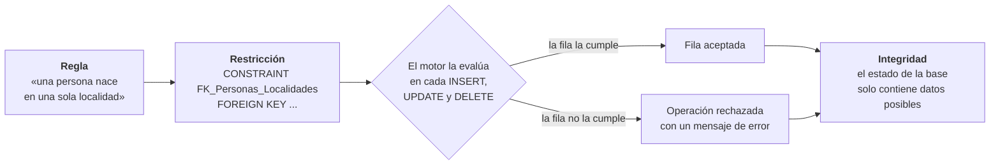
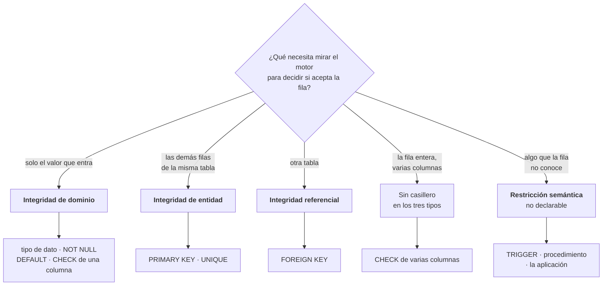
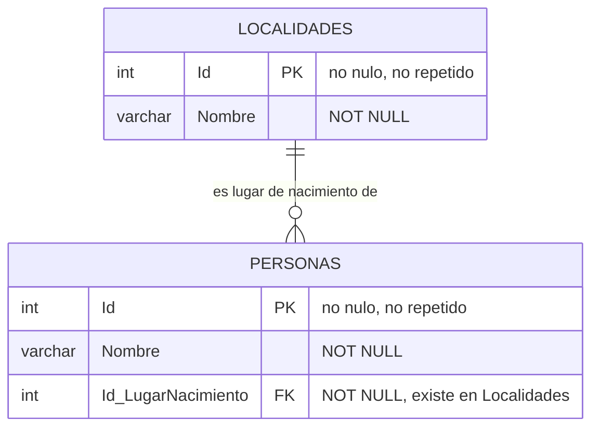

# Restricciones e integridad — SQL Server

> **De qué se trata**: de las dos herramientas con las que una base relacional se defiende de sus propios datos. Se define **restricción** e **integridad**, se clasifican las dos —cada una por su criterio—, y se materializa todo sobre un único caso: dos tablas, `Localidades` y `Personas`.
>
> **Cómo está escrito**: cada sección responde una pregunta. Las definiciones se declaran al principio (§1) y no se vuelven a discutir; los ejemplos van al final (§6) y son los mismos a lo largo de todo el documento, para que lo único que cambie entre uno y otro sea lo que se quiere mostrar.
>
> **Dialecto**: Transact-SQL (SQL Server). Todo el código de este documento está escrito para SQL Server y no se garantiza en otros motores.
>
> **De dónde sale**: reelabora el apunte de la cátedra «Integridad y restricciones» —de donde se toman los ejemplos y los mensajes de error literales— con las precisiones discutidas y verificadas contra bibliografía. Las tres correcciones respecto del apunte original están declaradas en la §7.3.
>
> **Qué se afirma y con qué**: las definiciones y las clasificaciones están respaldadas por las fuentes de la §8. Los mensajes de error son citas. **Los scripts de este documento no se ejecutaron**: lo que se afirma sobre el comportamiento del motor está razonado sobre la sintaxis y sobre la documentación, no verificado corriendo (§7.1).

---

## Índice

- **[1. Las definiciones](#1-las-definiciones)** — restricción, integridad, y la diferencia que hay que retener
- **[2. Cómo se clasifica la integridad](#2-cómo-se-clasifica-la-integridad)** — por lo que preserva: entidad, referencial, dominio
- **[3. Cómo se clasifican las restricciones](#3-cómo-se-clasifican-las-restricciones)** — por dónde se escriben: columna, tabla
- **[4. Las dos clasificaciones no se superponen](#4-las-dos-clasificaciones-no-se-superponen)** — la grilla, y por qué «de tabla» nunca responde «¿qué garantiza?»
- **[5. El caso](#5-el-caso)** — `Localidades` y `Personas`, y por qué se trabaja con valores
- **[6. Los ejemplos](#6-los-ejemplos)** — cuatro, cada uno agregando una capa. **Es la parte práctica**
- **[7. Los límites de este documento](#7-los-límites-de-este-documento)** — qué no se verificó, qué no se cubre, qué se corrigió del apunte
- **[8. Referencias](#8-referencias)**
- **[9. El criterio, en una línea](#9-el-criterio-en-una-línea)**

---

## 1. Las definiciones

Se declaran. Lo que se discute —por qué así— viene después.

> **Restricción** (*constraint*) — la **regla que se debe cumplir**, escrita en el esquema. El motor la hace cumplir en cada operación: rechaza la que dejaría datos que no la cumplen.
>
> **Integridad** — el **dato que cumple esa regla**. Es el estado en que queda la base cuando las restricciones se satisfacen.

En la bibliografía académica el par aparece con estas mismas dos piezas: «*Constraints are conditions that must hold on all valid relation states*» y «*a database state that does not meet the constraints is an invalid state*» — Elmasri & Navathe, cap. 5. **La restricción es una condición; la integridad es la propiedad del estado que la satisface.**

### 1.1 ¿Cómo se relacionan las dos?

**Respuesta: la restricción es el medio; la integridad es el resultado.**



Lo que hay que leer en el diagrama: **la integridad se sostiene por las dos ramas**, no solo por la de arriba. El estado queda íntegro tanto cuando la fila entra como cuando el motor la rechaza — y es la rama del rechazo la que hace el trabajo.

| | |
| --- | --- |
| ✅ | «La tabla **tiene** una `FOREIGN KEY`» — la restricción es un objeto: se cuenta, se lista, se borra con `ALTER TABLE` |
| ✅ | «Los datos **están** íntegros» — la integridad es una propiedad: no se cuenta ni se borra |
| ❌ | «La `FOREIGN KEY` **es** una integridad referencial» — confunde el medio con el resultado |

**La diferencia práctica:** para saber qué restricciones tiene una base se lee el esquema. Para saber si está íntegra hay que ir a los datos.

### 1.2 ¿Se puede tener integridad sin restricciones?

**Respuesta: sí, y por eso hace falta entender qué agregan las restricciones.**

Una tabla cargada con cuidado puede estar perfectamente íntegra sin que nada lo impida. Lo que agrega la restricción no es el estado: es que **ese estado ya no se pueda perder**.

| | |
| --- | --- |
| ✅ | «Sin `FOREIGN KEY`, la tabla puede estar íntegra por cómo se cargó» |
| ✅ | «Con `FOREIGN KEY`, no puede dejar de estarlo» |
| ❌ | «Sin `FOREIGN KEY` no hay integridad referencial» |

Al revés no ocurre: **no existe una base con la restricción declarada y datos que no la cumplan**, porque el motor no los habría dejado entrar. Esa asimetría es todo el argumento a favor de declarar.

### 1.3 ¿La integridad garantiza que los datos sean correctos?

**Respuesta: no. Garantiza que sean posibles.**

Si una fila dice que Arturo nació en la localidad `3`, la base garantiza que la localidad `3` existe. **No garantiza que Arturo haya nacido ahí.** Un dato falso pero posible entra sin que nada proteste, y es el más caro de encontrar justamente porque la base no protesta.

**Integridad no es verdad.** Las restricciones eliminan una clase de error —el imposible—; la otra clase pasa entera.

### 1.4 ¿Quién pone las restricciones?

**Respuesta: las declara quien diseña; el motor las hace cumplir.**

La documentación de Microsoft usa el verbo preciso: «*Constraints are rules that the SQL Server Database Engine **enforces** for you*». El motor no decide ninguna regla —acepta sin protestar una tabla con `FOREIGN KEY` y una sin ella—. **Cada restricción que existe es una decisión que alguien tomó y podría haber tomado distinto.**

---

## 2. Cómo se clasifica la integridad

El criterio es **qué propiedad de los datos queda garantizada**. Tres tipos.

### 2.1 ¿Cómo se decide de qué tipo es una regla?

**Respuesta: preguntando qué necesita mirar el motor para decidir si acepta la fila.**

Es el criterio que ordena los tres tipos, y de paso muestra dónde se termina lo declarable:



Las dos ramas de la derecha son las que ninguna clasificación de tres tipos acomoda, y están tratadas en la §2.5.

### 2.2 Integridad de entidad

**Cada fila se identifica de forma única, y esa identificación nunca falta.**

Son dos exigencias distintas, y conviene verlas separadas porque la bibliografía las separa:

| Exigencia | De dónde viene | Cómo se enuncia |
| --- | --- | --- |
| **Unicidad** | De que la clave sea clave | «*No two tuples in any valid relation state will have the same value*» |
| **No nulidad** | De la regla de integridad de entidad | «*The primary key attributes … cannot have null values in any tuple*» |

*(Elmasri & Navathe, cap. 5: la primera es el* key constraint*, la segunda es la* entity integrity*.)*

`PRIMARY KEY` hace cumplir las dos juntas. **`UNIQUE` hace cumplir solo la primera** — y por eso admite un `NULL` donde la primaria no lo admite (§3.5).

**Dónde termina:** garantiza que no haya dos **filas** con la misma identidad, no que no haya dos filas hablando de la misma **cosa**. Se ve en el Ejemplo 1 (§6.2): hay dos `'Daniela'` y dos `'Andrés'` con la clave primaria intacta, y la base no puede decir si son cuatro personas o dos cargadas dos veces.

### 2.3 Integridad referencial

**Toda referencia apunta a algo que existe.**

No hay «datos huérfanos»: si una fila nombra a otra tabla, la fila nombrada está. Se declara con `FOREIGN KEY` y se materializa en el Ejemplo 2 (§6.3).

**Dónde termina:** un `NULL` en la columna referenciante **no es un huérfano**. La definición admite las dos cosas: el valor de la clave foránea es «*a value of an existing primary key value … **or a null***» (Elmasri & Navathe). Que la referencia además sea **obligatoria** es otra decisión, y se toma con `NOT NULL`, que es integridad de dominio.

| Declaración | Qué dice del negocio |
| --- | --- |
| `Id_LugarNacimiento INT REFERENCES Localidades(Id)` | Toda persona *puede* tener lugar de nacimiento; si lo tiene, existe |
| `Id_LugarNacimiento INT NOT NULL REFERENCES Localidades(Id)` | Toda persona *debe* tener lugar de nacimiento |

**Un `NULL` ahí significa «no sé», no «error».** Distinguir «no sé» de «no aplica» ya no lo puede hacer la restricción.

### 2.4 Integridad de dominio

**Cada valor está dentro de lo que su columna admite.**

El tipo, el formato, el rango, la condición — y también la obligatoriedad: «vacío» no es un valor admitido. Se declara con el tipo de dato, `NOT NULL`, `DEFAULT` y `CHECK`, y se materializa en el Ejemplo 3 (§6.4).

Que `NOT NULL` sea de dominio no es una convención: es «*funcionalmente equivalente a `CHECK (columna IS NOT NULL)`*» (documentación de PostgreSQL, citada acá por el concepto, no por el dialecto). Si es un `CHECK` sobre una columna, restringe qué valores admite esa columna — que es la definición de dominio.

**Dónde termina:** `VARCHAR(100)` acepta cualquier cadena de hasta cien caracteres. Acepta `'Paraná'`, acepta `'Parana'` y acepta `'   '`. **El tipo de dato define el continente, no el contenido.**

Y hay un límite del `CHECK` que conviene conocer antes de confiarse: «*`CHECK` constraints reject values that evaluate to `FALSE`. Because null values evaluate to `UNKNOWN`, their presence in expressions might override a constraint*» (Microsoft). Un `CHECK (Edad >= 0)` **deja pasar un `NULL`**. Si el valor además es obligatorio, hace falta el `NOT NULL` aparte.

### 2.5 ¿Y las reglas de negocio?

**Respuesta: son un grupo aparte, definido por exclusión — no por su objeto, como los otros tres.**

La industria y la academia lo reconocen con dos nombres, y las dos definiciones dicen lo que el grupo **no** es:

| Fuente | Nombre | Cómo lo define |
| --- | --- | --- |
| Microsoft | *User-defined integrity* | «*business rules that **do not fall into one of the other integrity categories***» |
| Elmasri & Navathe | *Semantic integrity constraints* | «*based on application semantics and **cannot be expressed by the model per se***» |

**Por eso no está en el mismo eje que los otros tres**, y no sirve como respuesta a «¿de qué tipo es esta regla?».

Y hay que decir lo que **no** lo separa: los tres primeros tipos también vienen del negocio. «Una persona nace en una sola localidad» es una regla del negocio y es integridad referencial. **El origen no distingue nada; lo que distingue es si se puede declarar.**

Dos casos, para ver dónde cae el corte:

```sql
-- Se puede declarar: un CHECK que mira dos columnas de la misma fila.
CONSTRAINT CK_Pedido_Fechas CHECK (FechaEntrega >= FechaPedido)
```

Esa regla **no es integridad de dominio**, aunque se le parezca: dominio se define por atributo —«la validez de las entradas de **una columna determinada**» (Microsoft)—, y una condición entre dos columnas no lo es. El esquema de tres tipos no tiene casillero para ella; se declara igual.

El segundo caso ya no se puede declarar: «un cliente no puede tener más de tres pedidos abiertos» habla de un conjunto de filas que la fila entrante no conoce. Ahí hace falta un *trigger*, un procedimiento o la aplicación.

| | |
| --- | --- |
| ✅ | «Esta regla se declara con `CK_Pedido_Fechas`, aunque no sea de ninguno de los tres tipos» |
| ✅ | «Esta regla no se puede declarar; la hace cumplir el procedimiento X» |
| ⚠️ | «Esta regla es de negocio» — no dice ni si se puede declarar ni quién la cumple |
| ❌ | «La integridad de negocio es un cuarto tipo, al lado de los otros tres» |

**Esto no se clasifica: se administra.** Por cada regla enunciada, o hay una restricción que la cubre, o hay una razón declarada de por qué no y el nombre de quién la hace cumplir en su lugar.

---

## 3. Cómo se clasifican las restricciones

El criterio es otro: **dónde va la declaración dentro del `CREATE TABLE`**, que depende de cuántas columnas nombra.

### 3.1 Restricción de columna

**Se escribe adentro de la declaración de una columna y solo habla de ella.**

```sql
CREATE TABLE Ejemplo_Columna
(
    Id                 INT PRIMARY KEY,                      -- entidad
    Nombre             VARCHAR(100) NOT NULL,                -- dominio
    Activo             BIT DEFAULT 1,                        -- dominio
    Edad               INT CHECK (Edad >= 0),                -- dominio
    Id_LugarNacimiento INT REFERENCES Localidades(Id)        -- referencial
);
```

Según la gramática de `CREATE TABLE` de SQL Server, a nivel de columna se admiten `PRIMARY KEY`, `UNIQUE`, `FOREIGN KEY` en su forma `REFERENCES`, y `CHECK` — además de `NOT NULL` y `DEFAULT`.

### 3.2 Restricción de tabla

**Se escribe aparte de las columnas, después de todas, y puede nombrar a varias.**

```sql
CREATE TABLE Ejemplo_Tabla
(
    Id_Pedido    INT,
    Id_Producto  INT,
    FechaPedido  DATE,
    FechaEntrega DATE,
    CONSTRAINT PK_Detalle       PRIMARY KEY (Id_Pedido, Id_Producto),
    CONSTRAINT CK_Pedido_Fechas CHECK (FechaEntrega >= FechaPedido),
    CONSTRAINT FK_Detalle_Pedidos FOREIGN KEY (Id_Pedido)
        REFERENCES Pedidos(Id)
);
```

A nivel de tabla se admiten los mismos cuatro: `PRIMARY KEY`, `UNIQUE`, `FOREIGN KEY` y `CHECK`.

### 3.3 ¿Por qué casi todas aparecen en las dos listas?

**Respuesta: porque el tipo no es una propiedad de la restricción sino de cómo se la escribió.**

La documentación de PostgreSQL lo dice sin rodeos, y vale como concepto para cualquier motor relacional: «*Column constraints can also be written as table constraints, while the reverse is not necessarily possible, since a column constraint is supposed to refer to only the column it is attached to*».

Un `UNIQUE` no cambia de naturaleza según dónde se escriba: **cambia cuántas columnas nombra**. Y cuando nombra dos, no hay adentro de qué columna ponerlo — por eso va afuera.

| | |
| --- | --- |
| ✅ | «`UNIQUE` se declara a nivel de columna o de tabla, según cuántas nombre» |
| ⚠️ | «`UNIQUE` es una restricción de columna» — cierto con una sola columna, falso en general |
| ❌ | «Hay restricciones de columna y de tabla, y cada una es de una clase distinta» |

**Las dos únicas que no tienen forma de tabla** dentro del `CREATE TABLE` son `NOT NULL` y `DEFAULT`, porque hablan siempre de una columna nombrada y de ninguna otra.

### 3.4 ¿Para qué sirve entonces esta clasificación?

**Respuesta: para escribir el `CREATE TABLE`, y —lo que casi nunca se dice— para decidir si el error va a ser legible.**

Es una regla de escritura, y como tal es útil: una restricción que nombra dos columnas no entra adentro de ninguna de las dos. Pero tiene una consecuencia más cara. La forma de columna no deja lugar para el nombre, así que lo genera el motor: «*If `constraint_name` isn't supplied, a system-generated name is assigned to the constraint. **The constraint name appears in any error message about constraint violations**»* (Microsoft).

Comparar los dos errores del Ejemplo 4 (§6.5) alcanza:

```
Violation of PRIMARY KEY constraint 'PK__Personas__3214EC078DFC3B8A'.
The INSERT statement conflicted with the FOREIGN KEY constraint "FK_Localidades_PERSONAS".
```

El primero viene de `Id INT PRIMARY KEY`; el sufijo es generado y **cambia en cada base creada**, así que no se puede buscar en el código ni comparar entre entornos. El segundo viene de una restricción con nombre puesto a mano.

**Regla práctica de este documento:** toda restricción que no sea trivial se declara con `CONSTRAINT <nombre>`, aun cuando pudiera ir en la columna.

### 3.5 ¿Cuántos `NULL` admite un `UNIQUE`?

**Respuesta: en SQL Server, uno solo por columna.**

> «*Unlike `PRIMARY KEY` constraints, `UNIQUE` constraints allow for the value `NULL`. However … only one null value is allowed per column.*» — Microsoft

Es una particularidad de este motor y conviene saberla, porque el comportamiento habitual en otros —y en el estándar— es admitir varios. **En SQL Server, un `UNIQUE` sobre una columna nulable no sirve para modelar «este dato es opcional pero único cuando está».**

---

## 4. Las dos clasificaciones no se superponen

Es el punto que hace que todo lo anterior se ordene, y la única forma de verlo es poner las dos clasificaciones en los dos ejes de una misma tabla.

### 4.1 ¿Cómo se cruzan?

**Respuesta: en una grilla de tres por dos, y las seis celdas tienen contenido.**

| Integridad ↓ / Restricción → | **De columna** | **De tabla** |
| --- | --- | --- |
| **De entidad** | `Id INT PRIMARY KEY` <br> `Email VARCHAR(100) UNIQUE` | `CONSTRAINT PK_Detalle PRIMARY KEY (Id_Pedido, Id_Producto)` |
| **Referencial** | `Id_LugarNacimiento INT REFERENCES Localidades(Id)` | `CONSTRAINT FK_Personas_Localidades FOREIGN KEY (…) REFERENCES …` |
| **De dominio** | `Nombre VARCHAR(100) NOT NULL` <br> `Edad INT CHECK (Edad >= 0)` | `CONSTRAINT CK_Pedido_Fechas CHECK (FechaEntrega >= FechaPedido)` |

**Que las seis celdas tengan contenido es la demostración de que los ejes son independientes.** Si una clasificación fuera un detalle de la otra, habría celdas vacías. No las hay: cualquiera de los tres tipos de integridad se puede escribir de las dos maneras.

### 4.2 ¿Qué se lee en una fila y qué en una columna?

**Respuesta: la fila es homogénea; la columna no.**

| Se lee | Qué se encuentra | Qué tienen en común |
| --- | --- | --- |
| **Una fila** — «integridad referencial» | `REFERENCES` en línea y `CONSTRAINT … FOREIGN KEY` | **Todo**: es la misma garantía escrita de dos maneras |
| **Una columna** — «restricción de tabla» | `FOREIGN KEY`, `PRIMARY KEY`, `UNIQUE`, `CHECK` | **Solo el lugar donde se escriben** |

Puesto en el caso concreto: **una `FOREIGN KEY` de tabla asegura la integridad referencial, y eso se dice de ella con todo sentido. Un `UNIQUE`, que está en ese mismo grupo, no tiene nada que ver con la integridad referencial** — asegura la de entidad. Lo único que comparte con la `FOREIGN KEY` es dónde se escribe.

| | |
| --- | --- |
| ✅ | «`FOREIGN KEY` asegura la integridad referencial» |
| ✅ | «`UNIQUE` asegura la integridad de entidad» |
| ⚠️ | «`UNIQUE` es una restricción de tabla» — cierto, y no dice nada sobre qué preserva |
| ❌ | «Las restricciones de tabla aseguran la integridad referencial» |

**«De tabla» nunca puede ser la respuesta a «¿qué garantiza esto?».** Responde a otra pregunta: «¿dónde lo escribo?».

### 4.3 ¿En qué orden se usan las dos miradas?

**Respuesta: la de la integridad para diseñar; la de la restricción para escribir.**

1. **Qué quiero que sea verdad** de los datos → sale el tipo de integridad, y de ahí **cuál** restricción (§2).
2. **Cuántas columnas nombra** esa restricción → sale **dónde** la escribo y si le puedo poner nombre (§3).

Invertir el orden es el error típico: empezar por «acá va un `UNIQUE`» sin haber dicho qué se quiere impedir. **La segunda pregunta no se puede contestar mal si la primera se contestó bien.**

---

## 5. El caso

### 5.1 ¿Por qué se trabaja con valores y no con un diagrama?

**Respuesta: porque las restricciones se entienden cuando se ve qué fila entra y qué fila rebota.**

Un diagrama muestra la forma del modelo; los valores muestran la frontera. El caso es siempre el mismo par de tablas, y cada ejemplo le agrega una capa.



### 5.2 Los datos

| `Localidades` | | | `Personas` | | |
| --- | --- | --- | --- | --- | --- |
| **Id** | **Nombre** | | **Id** | **Nombre** | **Id_LugarNacimiento** |
| 1 | Paraná | | 1 | Daniela | 1 |
| 2 | La Paz | | 2 | Andrés | 2 |
| 3 | Hernandarias | | 3 | Daniela | 2 |
| 4 | Hasenkamp | | 4 | Andrés | 1 |
| | | | 5 | Armando | 1 |
| | | | 6 | Arturo | 3 |

**Dos cosas para tener a la vista desde ahora**, porque los ejemplos las van a usar:

- Hay **dos `'Daniela'` y dos `'Andrés'`**. Ninguna restricción de las que vamos a declarar lo impide, y esa es la lección de la §2.2.
- La localidad `4`, Hasenkamp, **no la usa nadie**. Sirve para ver que la `FOREIGN KEY` no obliga en el otro sentido.

---

## 6. Los ejemplos

### 6.1 ¿Cómo se prepara la base?

Se rehace desde cero en cada ejemplo, para que ninguno herede el estado del anterior. **El orden importa**: primero se sale de la base que se va a borrar, después se borra, después se crea, y recién ahí se entra.

```sql
USE master;
GO
DROP DATABASE IF EXISTS Ejemplo_Integridad_DB;
GO
CREATE DATABASE Ejemplo_Integridad_DB;
GO
USE Ejemplo_Integridad_DB;
GO
```

| | |
| --- | --- |
| ✅ | `USE master` → `DROP` → `CREATE` → `USE Ejemplo_Integridad_DB` |
| ❌ | `USE Ejemplo_Integridad_DB` antes del `CREATE DATABASE` — la base todavía no existe |

### 6.2 Ejemplo 1 — Integridad de entidad

**Qué se quiere:** que ninguna fila se confunda con otra.

```sql
CREATE TABLE Localidades
(
    Id     INT PRIMARY KEY,
    Nombre VARCHAR(100)
);
GO

INSERT INTO Localidades(Id, Nombre)
VALUES (1, 'Paraná'), (2, 'La Paz'), (3, 'Hernandarias'), (4, 'Hasenkamp');
GO

CREATE TABLE Personas
(
    Id                 INT PRIMARY KEY,
    Nombre             VARCHAR(100),
    Id_LugarNacimiento INT
);
GO

INSERT INTO Personas(Id, Nombre, Id_LugarNacimiento)
VALUES (1, 'Daniela', 1), (2, 'Andrés', 2), (3, 'Daniela', 2),
       (4, 'Andrés', 1),  (5, 'Armando', 1), (6, 'Arturo', 3);
GO

-- Listado de nombres y su lugar de nacimiento
SELECT p.Id, p.Nombre, l.Nombre AS LugarNacimiento
FROM Personas p
INNER JOIN Localidades l ON p.Id_LugarNacimiento = l.Id
ORDER BY l.Nombre;
```

**Qué hay y qué todavía no.** `Id_LugarNacimiento` es una columna `INT` común: **no hay `FOREIGN KEY`**. El `JOIN` funciona igual —los seis valores existen en `Localidades`— y ahí está la lección de la §1.2: **esta base está referencialmente íntegra sin ninguna restricción que la obligue a estarlo.**

**Lo que la `PRIMARY KEY` no hace:** las filas 1 y 3 son las dos `'Daniela'`. La clave primaria está intacta y la base no puede decir si son dos personas o una cargada dos veces.

### 6.3 Ejemplo 2 — Integridad referencial

**Qué se quiere:** que ninguna persona diga haber nacido en una localidad que no existe.

Las dos formas de declararlo son equivalentes en efecto y distintas en consecuencias:

```sql
-- Forma de columna: más corta, sin nombre propio
CREATE TABLE Personas
(
    Id                 INT PRIMARY KEY,
    Nombre             VARCHAR(100),
    Id_LugarNacimiento INT REFERENCES Localidades(Id)
);
```

```sql
-- Forma de tabla: con nombre propio  ← la que usa este documento
CREATE TABLE Personas
(
    Id                 INT PRIMARY KEY,
    Nombre             VARCHAR(100),
    Id_LugarNacimiento INT,
    CONSTRAINT FK_Personas_Localidades FOREIGN KEY (Id_LugarNacimiento)
        REFERENCES Localidades(Id)
);
```

**Por qué se elige la segunda:** por la §3.4 — el nombre aparece en el mensaje de error, y un nombre generado no se puede buscar.

**Convención de nombre adoptada:** `FK_<tabla que referencia>_<tabla referenciada>`. Se lee en el mismo orden en que va la flecha: `FK_Personas_Localidades` es «de Personas hacia Localidades». Es una decisión de este documento, no una regla del motor — pero **una convención cualquiera aplicada siempre vale más que la mejor convención aplicada a veces**.

**Lo que esta declaración todavía permite:** `Id_LugarNacimiento` sigue admitiendo `NULL`. Una persona sin lugar de nacimiento entra sin problema, y eso es correcto según la §2.3 — el `NULL` no es un huérfano. Si el negocio dice que el dato es obligatorio, falta el `NOT NULL`, y eso es el Ejemplo 3.

### 6.4 Ejemplo 3 — Integridad de dominio

**Qué se quiere:** que no haya nombres vacíos ni personas sin lugar de nacimiento.

```sql
CREATE TABLE Localidades
(
    Id     INT PRIMARY KEY,
    Nombre VARCHAR(100) NOT NULL
);
GO

CREATE TABLE Personas
(
    Id                 INT PRIMARY KEY,
    Nombre             VARCHAR(100) NOT NULL,
    Id_LugarNacimiento INT          NOT NULL,
    CONSTRAINT FK_Personas_Localidades FOREIGN KEY (Id_LugarNacimiento)
        REFERENCES Localidades(Id)
);
```

**Qué cambió respecto del Ejemplo 2, y no es poco:** con `NOT NULL` sobre `Id_LugarNacimiento`, la relación pasó de *opcional* a *obligatoria*. **El `NOT NULL` es lo que convierte «puede tener» en «debe tener»** — y lo hace una restricción de dominio, no la clave foránea.

**Hasta dónde llega `VARCHAR(100) NOT NULL`:** impide el nulo, no el vacío. `''` y `'   '` entran. Si el negocio pide un nombre real, hace falta agregar:

```sql
CONSTRAINT CK_Personas_Nombre CHECK (LEN(LTRIM(RTRIM(Nombre))) > 0)
```

*(Razonado sobre la semántica documentada de `LEN`, `LTRIM` y `RTRIM` en T-SQL; no ejecutado — ver §7.1.)*

### 6.5 Ejemplo 4 — Probar las restricciones

**Es el ejemplo más importante de todos**, porque es el único que corre **contra** la restricción en vez de a favor. Una restricción que nunca se vio rechazar algo es una restricción que no se sabe si está.

```sql
USE Ejemplo_Integridad_DB;
GO

-- (a) Dos personas con el mismo Id
INSERT INTO Personas(Id, Nombre, Id_LugarNacimiento) VALUES (1, 'Cecilia', 1);
GO

-- (b) Una persona sin nombre
INSERT INTO Personas(Id, Nombre, Id_LugarNacimiento) VALUES (7, NULL, 1);
GO

-- (c) Una persona nacida en una localidad que no existe
INSERT INTO Personas(Id, Nombre, Id_LugarNacimiento) VALUES (7, 'Cecilia', 100);
GO
```

Los tres mensajes, **citados literalmente del apunte de la cátedra**:

| | Qué se violó | Mensaje |
| --- | --- | --- |
| **(a)** | Entidad — `PRIMARY KEY` | `Violation of PRIMARY KEY constraint 'PK__Personas__3214EC078DFC3B8A'. Cannot insert duplicate key in object 'dbo.Personas'. The duplicate key value is (1).` |
| **(b)** | Dominio — `NOT NULL` | `Cannot insert the value NULL into column 'Nombre', table 'Ejemplo_Integridad_DB.dbo.Personas'; column does not allow nulls. INSERT fails.` |
| **(c)** | Referencial — `FOREIGN KEY` | `The INSERT statement conflicted with the FOREIGN KEY constraint "FK_Localidades_PERSONAS". The conflict occurred in database "Ejemplo_Integridad_DB", table "dbo.Localidades", column 'Id'.` |

**Los tres tipos de integridad, uno en cada mensaje.** Y la diferencia de legibilidad entre el primero y el tercero es exactamente el argumento de la §3.4: `PK__Personas__3214EC078DFC3B8A` lo generó el motor y cambia en cada base; `FK_Localidades_PERSONAS` lo escribió una persona.

*(Los nombres de restricción de estos mensajes son los del apunte original, anteriores a la convención adoptada en la §6.3.)*

### 6.6 El script completo

```sql
-- ============================================================
-- Integridad y restricciones — SQL Server
-- Base de ejemplo: Localidades y Personas
-- ============================================================

USE master;
GO
DROP DATABASE IF EXISTS Ejemplo_Integridad_DB;
GO
CREATE DATABASE Ejemplo_Integridad_DB;
GO
USE Ejemplo_Integridad_DB;
GO

-- ---------- Localidades ----------
CREATE TABLE Localidades
(
    Id     INT          NOT NULL,
    Nombre VARCHAR(100) NOT NULL,
    CONSTRAINT PK_Localidades PRIMARY KEY (Id)
);
GO

INSERT INTO Localidades(Id, Nombre)
VALUES (1, 'Paraná'), (2, 'La Paz'), (3, 'Hernandarias'), (4, 'Hasenkamp');
GO

-- ---------- Personas ----------
CREATE TABLE Personas
(
    Id                 INT          NOT NULL,
    Nombre             VARCHAR(100) NOT NULL,
    Id_LugarNacimiento INT          NOT NULL,
    CONSTRAINT PK_Personas            PRIMARY KEY (Id),
    CONSTRAINT FK_Personas_Localidades FOREIGN KEY (Id_LugarNacimiento)
        REFERENCES Localidades(Id)
);
GO

INSERT INTO Personas(Id, Nombre, Id_LugarNacimiento)
VALUES (1, 'Daniela', 1), (2, 'Andrés', 2), (3, 'Daniela', 2),
       (4, 'Andrés', 1),  (5, 'Armando', 1), (6, 'Arturo', 3);
GO

-- ---------- Consulta ----------
SELECT p.Id, p.Nombre, l.Nombre AS LugarNacimiento
FROM Personas p
INNER JOIN Localidades l ON p.Id_LugarNacimiento = l.Id
ORDER BY l.Nombre;
```

**Ocho restricciones, tres tipos de integridad, dos alcances.** Cinco `NOT NULL` —dominio, de columna—, dos `PRIMARY KEY` —entidad— y una `FOREIGN KEY` —referencial—, estas tres últimas escritas como restricciones de tabla. Los números no coinciden porque cuentan cosas distintas: es la §4 en una sola pantalla.

**Las tres que admiten nombre lo tienen.** `NOT NULL` no lleva nombre propio —no lo admite—, así que aparece en los errores identificado por la columna, como se ve en el mensaje (b) de la §6.5. Las otras tres van a nombrarse solas en cualquier error: ninguna traerá un sufijo generado.

---

## 7. Los límites de este documento

### 7.1 Lo que no se verificó

| Ausencia | Tipo | Estado |
| --- | --- | --- |
| Que los scripts corran | **Pendiente** | Ninguno se ejecutó contra un SQL Server. Lo que se afirma del motor está razonado sobre su documentación y su sintaxis |
| Los mensajes de error | **Citados** | Son los del apunte de la cátedra, no reproducidos por nosotros |
| El texto del estándar ISO/IEC 9075 | **Pendiente** | No se consiguió completo; donde hacía falta se citó documentación de producto |

### 7.2 Lo que no se cubre

| Ausencia | Tipo | Qué corresponde |
| --- | --- | --- |
| `ON DELETE` / `ON UPDATE` | **Pendiente** | Qué pasa al borrar una localidad usada es una decisión de diseño y merece su propio tratamiento. Sin declararlas, SQL Server aplica su comportamiento por omisión |
| *Triggers*, `ASSERTION` y procedimientos | **Otra herramienta** | Es como se hacen cumplir las reglas de la §2.5 que no se pueden declarar |
| Índices | **Otra herramienta** | `PRIMARY KEY` y `UNIQUE` se apoyan en índices, pero eso es rendimiento, no integridad |
| Colación y acentos | **Pendiente** | Si `'Parana'` y `'Paraná'` son el mismo valor lo decide la colación de la columna, no el tipo |
| `IDENTITY` y generación de claves | **Pendiente** | Acá las claves se escriben a mano para poder verlas; en producción la pregunta es quién genera el próximo `Id` |
| Composición, agregación y herencia | **No aplica acá** | Es el mapeo que anuncia el temario; va en su propio documento |

### 7.3 Qué se corrigió respecto del apunte original

Se anota, no se arregla en silencio.

| # | Qué decía | Qué se hizo |
| --- | --- | --- |
| 1 | La Figura 3.7 declara la columna `Id_LugarNacimiento` y la referencia como `Id_LuagarNacimiento` | Corregido. Tal como está, el `CREATE TABLE` no compila |
| 2 | El primer fragmento de la sección III hace `USE Ejemplo_Integridad_DB` **antes** del `CREATE DATABASE` | Corregido y explicado en la §6.1 |
| 3 | El enunciado del Ejemplo 2 dice «aplicar la integridad **de entidad**» en un ejemplo de integridad referencial | Corregido |
| 4 | La localidad 1 es `'Parana'` en dos ejemplos y `'Paraná'` en el tercero; la Figura 3.7 dice `'Daniel'` donde el resto dice `'Daniela'` | Unificado en `'Paraná'` y `'Daniela'`; la cuestión de fondo queda anotada en la §7.2 |
| 5 | `FOREIGN KEY` figura solo entre las restricciones de tabla, y el Ejemplo 2 la declara sobre la columna | Tratado en la §3.3: el eje clasifica declaraciones, no restricciones |
| 6 | La integridad de negocio aparece como cuarto tipo, al lado de los otros tres | Tratado en la §2.5: es un grupo definido por exclusión, no por su objeto |
| 7 | `CHECK` y `DEFAULT` se clasifican pero no se ejemplifican nunca | Ejemplificados en las §2.4, §2.5, §3.1 y §3.2 |

---

## 8. Referencias

| Fuente | Para qué se usó |
| --- | --- |
| Apunte de cátedra «UTN - FRP - TUP - Programación aplicada - SQL Server - Integridad y restricciones» | Los ejemplos, los datos y los mensajes de error literales |
| Elmasri & Navathe, *Fundamentals of Database Systems*, cap. 5 — [material publicado](https://www.cs.purdue.edu/homes/bb/cs448_Fall2017/lpdf/Chapter05.pdf) | Las definiciones de restricción, estado válido, *key constraint*, integridad de entidad y referencial, y restricciones semánticas |
| Microsoft Learn — [`CREATE TABLE (Transact-SQL)`](https://learn.microsoft.com/en-us/sql/t-sql/statements/create-table-transact-sql?view=sql-server-ver17) | La gramática de restricciones de columna y de tabla, y los nombres generados |
| Microsoft Learn — [Unique constraints and check constraints](https://learn.microsoft.com/en-us/sql/relational-databases/tables/unique-constraints-and-check-constraints?view=sql-server-ver17) | `UNIQUE` y los nulos, `CHECK` y la integridad de dominio, y el límite del `CHECK` con `UNKNOWN` |
| Microsoft Learn — [Data Integrity](https://learn.microsoft.com/en-us/previous-versions/sql/sql-server-2008-r2/ms184276(v=sql.105)) | La clasificación en cuatro tipos y la definición de *user-defined integrity* |
| PostgreSQL — [Constraints](https://www.postgresql.org/docs/current/ddl-constraints.html) | La equivalencia entre restricción de columna y de tabla, y `NOT NULL` como `CHECK` — citadas **por el concepto**, no por el dialecto |

El detalle de qué afirmación sostiene cada fuente, y cuáles son razonamiento propio, está en `PROMPTs/Analisis/OUTPUTs/Respaldo-Bibliografico.md`.

---

## 9. El criterio, en una línea

> **La restricción es la regla que se debe cumplir; la integridad es el dato que la cumple. Una se lee en el esquema, la otra se comprueba en las filas — y por eso una se clasifica por dónde se escribe y la otra por lo que preserva.**
