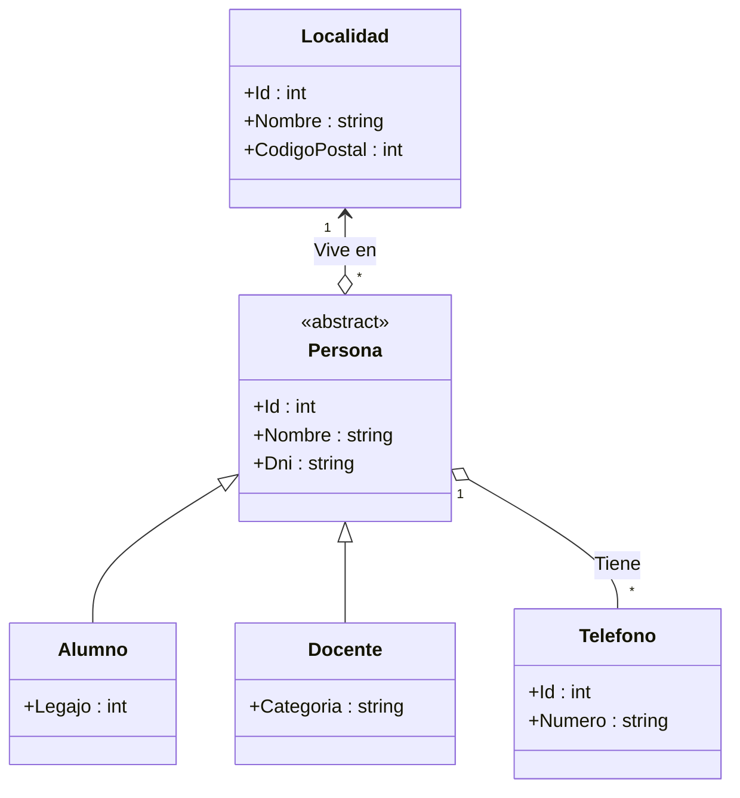

# Guía 3.1. Integridad referencial, restricciones — Mapeo de herencia

**UTN - FRP - TUP - Programación aplicada 2026 - Acceso a datos - SQL Server**

[Home](https://docs.google.com/document/d/1fU7NQupaFc95iPifZDb__KNbMF07a2dEiJU1Emimv0g/preview) / [Aplicada 2026](https://docs.google.com/document/d/1o-iFNkw3PyW0xb7arr3JwQXRaZ_FKOh6MO4sC_dAR5g/preview)

**Referencias**

[Integridad y restricciones — Mapeo de herencia](../Restricciones-Integridad-Herencia.md) · [Guía 2.1 — Composición y agregación](../../Tema2/Guia2.1/Guia2.1.Restricciones-Integridad.md)

> «Una jerarquía siempre entra en tablas. Lo que hay que decidir
> es qué se deja de poder garantizar cuando entra».

- **fork**: <https://github.com/UTN-FRP-TUP-Aplicada-2025/tup_aplicada_2025_guia3.1>
- **sol**: <https://github.com/fernandofilipuzzi-dev/tup_aplicada_2025_guia3.1>

---

## Índice

- **[Introducción](#introducción)**
- **[El modelo de datos](#el-modelo-de-datos)** — el mismo para los tres ejercicios
- **[Ejercicio 1. Persona-Alumno-Docente. Tabla por jerarquía (TPH)](#ejercicio-1-persona-alumno-docente-tabla-por-jerarquía-tph)**
- **[Ejercicio 2. Persona-Alumno-Docente. Tabla por subclase (TPT)](#ejercicio-2-persona-alumno-docente-tabla-por-subclase-tpt)**
- **[Ejercicio 3. Persona-Alumno-Docente. Tabla por clase concreta (TPC)](#ejercicio-3-persona-alumno-docente-tabla-por-clase-concreta-tpc)**
- **[Cierre. El ayudante](#cierre-el-ayudante)**
- **[Nota](#nota)**

---

## Introducción

En la guía anterior el problema era cómo se escribe que una cosa es parte de otra. Acá el problema es otro y viene del mismo lugar: **las tablas no heredan**. Un `Alumno` es una `Persona` con algo más, y esa frase, que en el modelo de objetos es una línea, en el modelo relacional no se puede escribir.

Cuando configuraba un mapeador, para la composición y la agregación me apoyaba siempre en el modelo de datos. Armaba un ejemplo chico y miraba el DDL que salía: si las claves de referencia aparecían donde yo las esperaba, si hacía falta o no una tabla relacional, si el borrado en cascada estaba donde tenía que estar. **Con eso me alcanzaba para saber si el mapeo estaba bien**, porque había una sola respuesta correcta y el conjunto de datos me la confirmaba o me la desmentía.

**Con la herencia eso deja de funcionar, y me llevó un tiempo entender por qué: no hay un único DDL correcto.** Las tres estrategias lo son. Un conjunto de datos válido entra en las tres. Así que el método de la guía anterior —comparar el DDL con el que yo esperaba— se queda sin contra qué comparar.

Lo que quedaba entonces eran tres preguntas, que aparecen juntas y se contestan mal si uno no las separa:

- **Qué estrategia elegir.**
- **Qué usar como discriminador.**
- **Qué implica resolverlo con una sola tabla, y qué implica tener varias.**

La segunda es la que más me costó, y por un motivo que recién entendí comparando: **el discriminador está en las tres estrategias, pero en cada una vive en un lugar distinto.** En una es una columna que uno declara; en otra hay que deducirlo preguntando en qué tabla apareció la fila; en la tercera lo dice el nombre de la tabla y no hay nada que declarar. Si uno viene de la primera, en las otras dos lo busca donde no está.

Y la tercera —una tabla o varias— parece una cuestión de comodidad y no lo es: **cada una regala una garantía distinta**, y si uno no elige a conciencia, la elige igual, por omisión.

**El conjunto de datos sigue sirviendo, pero para otra cosa.** Ya no confirma que el mapeo esté bien, porque los tres lo están: ahora muestra **qué deja entrar cada esquema que el modelo de objetos no admite**. Por eso cada ejercicio termina con una actividad que no crea nada — intenta escribir algo que el modelo no permite, para ver si el esquema lo frena. Ahí es donde las tres dejan de parecerse, y ahí aparecen los criterios para elegir.

Así que estos tres ejercicios son **el mismo modelo mapeado de tres formas**. No cambia el dominio, no cambian los datos, no cambian las clases. Cambia únicamente dónde van las columnas.

---

## El modelo de datos

Se tiene en la Figura 1 las siguientes clases relacionadas que representan el modelo de datos.



*Figura 1. Modelo de datos del dominio.*

Las premisas del modelo, que son las que después hay que poder defender con datos:

- **`Persona` es abstracta**: no existe una persona registrada que no sea ni alumno ni docente.
- **Una persona es alumno o docente, no las dos cosas.** *(Sobre esta premisa vuelvo en el cierre, porque es la más discutible de las tres.)*
- **Un teléfono es de una persona**, sea alumno o docente. Al teléfono no le importa cuál.
- **Toda persona vive en una localidad**, y la localidad no es parte de la persona: es una agregación, como la de la Guía 2.1.

### Los datos

Son los mismos en los tres ejercicios. **Si un esquema no puede representar exactamente esto, ese esquema está mal.**

| `Localidades` | | |
| :-: | :-: | :-: |
| **Id** | **Nombre** | **CodigoPostal** |
| 1 | Paraná | 3100 |
| 2 | Hernadarias | 3127 |
| 3 | Hasenkamp | 3134 |

| `Personas` | | | | | |
| :-: | :-: | :-: | :-: | :-: | :-: |
| **Id** | **Nombre** | **Dni** | **Id_Localidad** | **Es** | **Dato propio** |
| 1 | Luisa | 30111222 | 1 | Alumno | Legajo 20101 |
| 2 | Ernesto | 28999111 | 2 | Alumno | Legajo 20102 |
| 3 | Lucrecia | 31222333 | 1 | Alumno | Legajo 20103 |
| 4 | Ricardo | 20111000 | 1 | Docente | Categoría Titular |
| 5 | Leonel | 32444555 | 2 | Alumno | Legajo 20104 |
| 6 | Liliana | 19888777 | 3 | Docente | Categoría Adjunta |

| `Telefonos` | | |
| :-: | :-: | :-: |
| **Id** | **Id_Persona** | **Numero** |
| 1 | 1 | 343-4001 |
| 2 | 4 | 343-4002 |
| 3 | 5 | 343-4003 |

**Seis personas, cuatro alumnos y dos docentes.** Con eso alcanza: dos subclases y una columna propia en cada una ya distinguen los tres mapeos.

**Y mirar la tabla de teléfonos con atención.** El teléfono 2 es de Ricardo, que es docente; los otros dos son de alumnos. **La tabla no distingue**, y no debería: apunta a una persona. Esa columna, `Id_Persona`, es la que va a decidir buena parte del Ejercicio 3.

---

## Ejercicio 1. Persona-Alumno-Docente. Tabla por jerarquía (TPH)

Toda la jerarquía en una sola tabla, con una columna que dice de qué tipo es cada fila.

Podemos plantear las tablas equivalentes para dicho modelo de datos.

| `Personas` — *`Id`: clave primaria · `Tipo`: no permite nulables · `Id_Localidad`: clave foránea, no permite nulables* | | | | | | |
| :-: | :-: | :-: | :-: | :-: | :-: | :-: |
| **Id** | **Tipo** | **Nombre** | **Dni** | **Id_Localidad** | **Legajo** | **Categoria** |
| 1 | 1 | Luisa | 30111222 | 1 | 20101 | NULL |
| 2 | 1 | Ernesto | 28999111 | 2 | 20102 | NULL |
| 3 | 1 | Lucrecia | 31222333 | 1 | 20103 | NULL |
| 4 | 2 | Ricardo | 20111000 | 1 | NULL | Titular |
| 5 | 1 | Leonel | 32444555 | 2 | 20104 | NULL |
| 6 | 2 | Liliana | 19888777 | 3 | NULL | Adjunta |

*Figura 1.1. Tabla Personas. `Tipo` vale 1 para alumno y 2 para docente.*

En este punto planteo las premisas que me permiten saber si voy bien.

### Discriminador

`Tipo` no lleva `UNIQUE`. Se repite tantas veces como personas haya de cada clase: acá hay cuatro filas con `Tipo = 1` y dos con `Tipo = 2`.

Así tenemos:

- Cada fila es una persona completa.
- La columna `Tipo` dice de qué clase es.

Por lo tanto:

- **Una consulta, sin `JOIN`, para cualquier persona.**

### Nulos

`Legajo` y `Categoria` tienen que admitir nulos, y no es una elección: **una fila que es alumno no tiene categoría que poner.** Es el precio conocido de esta estrategia.

Pero el precio que importa es otro, y no es el espacio: **nada impide una fila con `Tipo = 1` y `Categoria = 'Titular'`** — un alumno con categoría docente. La correspondencia entre el discriminador y las columnas que deben quedar vacías **no está declarada en ningún lado**, y es lo que la última actividad pone a prueba.

### Las claves foráneas

Ni `Telefonos` ni `Localidades` dan trabajo: hay una sola tabla `Personas`, así que las dos claves foráneas —la que entra desde los teléfonos y la que sale hacia las localidades— se declaran una vez y listo. **Vale la pena registrarlo, porque en el Ejercicio 3 ninguna de las dos va a ser gratis.**

### Actividades

1. Realizar el script que cree la base de datos, las tablas, las restricciones y la inserción de los datos dados en la Figura 1.1, más `Localidades` y `Telefonos`. (`1_creando_base_de_prueba.sql`)
2. Listar todas las personas con su localidad, y después solo los docentes. Comparar las dos consultas: cuántos `JOIN` hizo falta en cada una. (`2_consultas.sql`)
3. Intentar insertar un alumno con categoría —`Tipo = 1` y `Categoria = 'Titular'`— y ver qué pasa. Después agregar la restricción que lo impida y volver a intentarlo. Dejar en el script los dos intentos, con el mensaje de error que devuelve el segundo. (`3_check_especializacion.sql`)

> **Nota.** La actividad 3 es la que hace la diferencia entre un esquema que **guarda** una jerarquía y uno que la **garantiza**. Sin esa restricción, la tabla admite personas que el modelo de objetos no puede representar.

---

## Ejercicio 2. Persona-Alumno-Docente. Tabla por subclase (TPT)

Una tabla para la clase base y una por cada subclase. La clave primaria de la hija es, al mismo tiempo, la clave foránea hacia la base.

Podemos plantear las tablas equivalentes para dicho modelo de datos.

| `Personas` — *`Id`: clave primaria* | | | |
| :-: | :-: | :-: | :-: |
| **Id** | **Nombre** | **Dni** | **Id_Localidad** |
| 1 | Luisa | 30111222 | 1 |
| 2 | Ernesto | 28999111 | 2 |
| 3 | Lucrecia | 31222333 | 1 |
| 4 | Ricardo | 20111000 | 1 |
| 5 | Leonel | 32444555 | 2 |
| 6 | Liliana | 19888777 | 3 |

| `Personas_Alumnos` — *`Id`: clave primaria y referencia a `Id` de Personas* | |
| :-: | :-: |
| **Id** | **Legajo** |
| 1 | 20101 |
| 2 | 20102 |
| 3 | 20103 |
| 5 | 20104 |

| `Personas_Docentes` — *`Id`: clave primaria y referencia a `Id` de Personas* | |
| :-: | :-: |
| **Id** | **Categoria** |
| 4 | Titular |
| 6 | Adjunta |

*Figura 2.1. (a) Tabla Personas. (b) Tabla Personas_Alumnos. (c) Tabla Personas_Docentes.*

### Identidad

Que `Id` sea a la vez clave primaria y clave foránea dice dos cosas de una sola vez:

- Como **primaria**: hay a lo sumo una fila hija por persona.
- Como **foránea**: esa persona existe.

Así tenemos:

- La fila de `Personas_Alumnos` no tiene identidad propia; la toma prestada de `Personas`.

Por lo tanto:

- **La fila hija no es otra entidad: es la misma persona, con más atributos.**

### Borrado

Y de eso se sigue el borrado en cascada, que es el mismo razonamiento de la composición de la Guía 2.1: **borrada la persona, su fila de alumno no queda huérfana — queda sin significado**, porque era la mitad de algo cuya otra mitad ya no está.

### Nulos

No hay. Ninguna columna de las tablas hijas admite nulo, porque un docente no tiene dónde poner un legajo. **El problema del Ejercicio 1 acá no existe: lo resuelve la estructura, no una restricción.**

### Lo que esta estrategia no garantiza

Nada obliga a que exista **exactamente una** fila hija. Se puede insertar una persona y no darle ni fila de alumno ni de docente —y el modelo dice que `Persona` es abstracta—. Y tampoco hay nada que impida ponerle las dos.

**Ese agujero no se tapa con un `CHECK`**, porque la condición mira otras tablas y un `CHECK` solo ve la fila que entra.

### Actividades

1. Realizar el script que cree la base de datos, las tablas, las restricciones y la inserción de los datos dados en la Figura 2.1. Las claves foráneas de las tablas hijas van con `ON DELETE CASCADE`. (`1_creando_base_de_prueba.sql`)
2. Escribir la consulta que, dado un `Id`, devuelva la persona con su tipo y su dato propio. Como no hay discriminador, el tipo hay que deducirlo: un `LEFT JOIN` por subclase y un `CASE` que mire cuál trajo fila. (`2_consulta_por_id.sql`)
3. Borrar a Ricardo de `Personas` y verificar que desapareció también de `Personas_Docentes`. Hacer la consulta de la actividad 2 antes y después del borrado. (`3_delete_ricardo.sql`)
4. Insertar una persona sin fila hija y volver a correr la consulta de la actividad 2. Anotar qué devuelve la columna del tipo. (`4_persona_sin_subclase.sql`)

> **Nota.** En la actividad 4 el `CASE` va a devolver algo así como «No definido». Ese valor no es defensivo: **es el nombre de un estado que el esquema permite y el modelo de objetos no.**

---

## Ejercicio 3. Persona-Alumno-Docente. Tabla por clase concreta (TPC)

Una tabla por cada clase concreta, con todas sus columnas —propias y heredadas—. **No hay tabla para la clase base.**

Podemos plantear las tablas equivalentes para dicho modelo de datos.

| `Alumnos` — *`Id`: clave primaria* | | | | |
| :-: | :-: | :-: | :-: | :-: |
| **Id** | **Nombre** | **Dni** | **Id_Localidad** | **Legajo** |
| 1 | Luisa | 30111222 | 1 | 20101 |
| 2 | Ernesto | 28999111 | 2 | 20102 |
| 3 | Lucrecia | 31222333 | 1 | 20103 |
| 5 | Leonel | 32444555 | 2 | 20104 |

| `Docentes` — *`Id`: clave primaria* | | | | |
| :-: | :-: | :-: | :-: | :-: |
| **Id** | **Nombre** | **Dni** | **Id_Localidad** | **Categoria** |
| 4 | Ricardo | 20111000 | 1 | Titular |
| 6 | Liliana | 19888777 | 3 | Adjunta |

*Figura 3.1. (a) Tabla Alumnos. (b) Tabla Docentes.*

### Identificadores

Mirar los `Id`: van 1, 2, 3, 5 en una tabla y 4, 6 en la otra. **No se repiten, y eso no puede quedar librado a la suerte.** Si cada tabla generara su propia numeración con `IDENTITY`, las dos empezarían en 1 y habría un alumno y un docente con el mismo identificador —dos personas distintas con el mismo número—.

Por lo tanto:

- **La numeración tiene que salir de un solo lado.** En SQL Server, de una secuencia compartida por las dos tablas.

### La clave foránea que sale

`Id_Localidad` está repetida en las dos tablas, y con ella su clave foránea hacia `Localidades`. Funciona, pero **hay que declararla dos veces**, y con cada subclase nueva otra vez. Es la duplicación de columnas de la que habla el apunte, vista de cerca.

### La clave foránea que entra

Y acá aparece lo que esta estrategia no puede hacer. **La tabla `Telefonos` tiene que apuntar a una persona cualquiera, y ya no hay ninguna tabla que las tenga a todas.** El teléfono 2 es de Ricardo, que está en `Docentes`; el 1 es de Luisa, que está en `Alumnos`.

```sql
CREATE TABLE Telefonos
(
    Id         INT NOT NULL,
    Id_Persona INT NOT NULL,     -- ¿referencia a qué tabla?
    Numero     VARCHAR(20) NOT NULL,
    CONSTRAINT PK_Telefonos PRIMARY KEY (Id)
);
```

Así tenemos:

- No hay una tabla `Personas` a la que referenciar.
- Una clave foránea apunta a **una** tabla, no a dos.

Por lo tanto:

- **La integridad referencial hacia la jerarquía deja de existir.** No es que la consulta salga incómoda: es que la restricción **no se puede escribir**.

En el Ejercicio 1 esa clave foránea era una línea. En el 2 también —apuntaba a `Personas`—. Acá no hay dónde.

### Actividades

1. Realizar el script que cree la base de datos, las tablas, las restricciones y la inserción de los datos dados en la Figura 3.1. La numeración de `Id` sale de una secuencia compartida, no de `IDENTITY`. (`1_creando_base_de_prueba.sql`)
2. Listar todas las personas —alumnos y docentes— en un solo resultado, con una columna que diga de qué tipo es cada una. (`2_todas_las_personas.sql`)
3. Crear `Telefonos` **con la clave foránea que garantice que `Id_Persona` es una persona existente** — la misma que en los ejercicios anteriores se escribió sin pensarla. Cuando se vea que no hay a qué tabla apuntar, dejar en el script el intento comentado y escribir debajo qué habría que hacer para conseguir esa garantía sin clave foránea. (`3_telefonos_sin_fk.sql`)
4. Comparar las tres consultas de «listar todas las personas»: la del Ejercicio 1, la del 2 y la de este. Anotar cuántas tablas toca cada una y qué habría que cambiar en cada script si mañana aparece una tercera subclase, `Preceptor`. (`4_comparacion.sql`)

> **Nota.** La actividad 3 no se puede terminar, y esa es la respuesta. Un ejercicio que no cierra enseña más que uno que sale a la primera, siempre que se sepa **por qué** no cierra.

---

## Cierre. El ayudante

Queda una premisa del modelo sin discutir, y es la más floja de las tres: *«una persona es alumno o docente, no las dos cosas»*.

En cualquier facultad hay ayudantes de cátedra: alumnos que además dan clase. **Si esa persona existe, la premisa es falsa** y las tres estrategias contestan distinto:

| Estrategia | Qué pasa con el ayudante |
| --- | --- |
| **TPH** | **No entra.** `Tipo` guarda un valor: la fila es alumno o es docente. Para representarlo habría que cambiar el discriminador por dos columnas de sí/no |
| **TPT** | **Entra sin tocar nada.** Una fila en `Personas` y dos filas hijas, una en cada tabla. Es la única de las tres que lo admite tal como está |
| **TPC** | **Entra duplicado.** Dos filas, dos identificadores, dos veces el mismo DNI. Y nada que lo impida |

Actividad final, y no lleva script: **decidir si en el modelo el ayudante existe**, y a partir de esa decisión elegir la estrategia. Escribir en el `Readme.md` la premisa elegida y su consecuencia.

> **Nota.** Es el orden que vengo usando desde la primera guía. El conjunto de datos válidos se arma antes que el esquema, y el esquema se elige para que ese conjunto entre entero y nada más entre. **Si el ayudante está en los datos, TPH quedó afuera antes de escribir la primera línea de SQL.**

---

## Nota

Los nombres de las personas y las localidades —Paraná, Hernadarias y Hasenkamp con sus códigos postales— vienen de la [Guía 2.1](../../Tema2/Guia2.1/Guia2.1.Restricciones-Integridad.md), para que el universo sea el mismo. **Los DNI, los legajos y los teléfonos son inventados** y no representan a nadie.

Las figuras de esta guía son tablas de markdown y un diagrama mermaid, y no las imágenes dibujadas de las guías anteriores.

**Los repositorios `fork` y `sol` del encabezado son los del ciclo 2025 y están pendientes de actualizar.**
