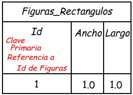
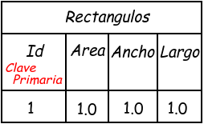
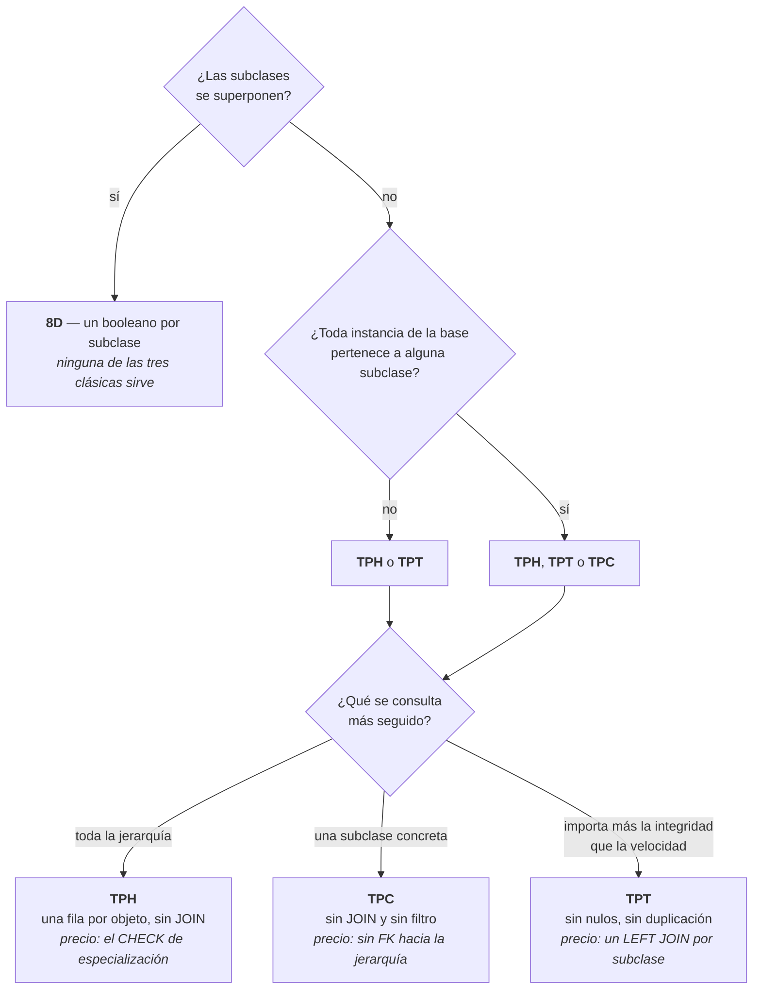

# Mapeo de herencia — SQL Server

> **De qué se trata**: una jerarquía de clases tiene que entrar en tablas, y las tablas no heredan. Hay tres formas conocidas de resolverlo, y este documento las presenta con **la pregunta que el catálogo de ventajas y desventajas no hace: qué integridad pierde cada una**.
>
> **La tesis**: elegir entre TPH, TPT y TPC no es una decisión de rendimiento sino de **qué está dispuesto a no garantizar el esquema**. Las tres aplanan la jerarquía, y cada una rompe una garantía distinta (§2).
>
> **Dialecto**: Transact-SQL (SQL Server).
>
> **De dónde sale**: reelabora el apunte de cátedra «Integridad y restricciones. Mapeo de herencia», del que se reutilizan el ejemplo, las figuras y los datos. **Su SQL tenía defectos que impiden ejecutarlo**; las correcciones están declaradas en la §7.3. Se agregan las condiciones de validez de Elmasri & Navathe y las precisiones de la documentación de EF Core (§8).
>
> **Qué se afirma y con qué**: las citas están marcadas y referenciadas. **Ningún script se ejecutó**: lo que se afirma del motor está razonado sobre la sintaxis y sobre la documentación (§7.1).

---

## Índice

- **[1. Definiciones](#1-definiciones)** — jerarquía, discriminador, disjunción, totalidad
- **[2. El problema](#2-el-problema)** — qué se pierde al aplanar una jerarquía. **Es el eje del documento**
- **[3. Tabla por jerarquía (TPH)](#3-tabla-por-jerarquía-tph)** — una tabla y un discriminador
- **[4. Tabla por subclase (TPT)](#4-tabla-por-subclase-tpt)** — una tabla por tipo, encadenadas por la clave
- **[5. Tabla por clase concreta (TPC)](#5-tabla-por-clase-concreta-tpc)** — una tabla por hoja, sin base
- **[6. Cómo se elige](#6-cómo-se-elige)** — los dos ejes: validez y conveniencia
- **[7. Los límites de este documento](#7-los-límites-de-este-documento)**
- **[8. Referencias](#8-referencias)**
- **[9. El criterio, en una línea](#9-el-criterio-en-una-línea)**

---

## 1. Definiciones

> **Jerarquía** — una clase base y sus derivadas.
>
> **Especialización** — el nombre de la relación entre la superclase y sus subclases. Es el término de la bibliografía académica para lo mismo que en código se llama herencia.
>
> **Discriminador** — columna que indica de qué subclase es cada fila. Elmasri & Navathe lo llaman *type attribute*; EF Core, *discriminator column*.
>
> **Disjunción** — que una instancia pertenezca **a lo sumo** a una subclase. Un rectángulo no es además un círculo.
>
> **Totalidad** — que toda instancia de la superclase pertenezca **al menos** a una subclase. No existen «figuras a secas».

**Disjunción y totalidad no son adornos teóricos: son las dos condiciones que deciden si una estrategia es siquiera aplicable** (§6.1).

### 1.1 El modelo de objetos del que se parte

Es el mismo para las tres estrategias. Nada de lo que sigue lo modifica.


```csharp
abstract class Figura
{
    public int Id { get; set; }
    public double Area { get; set; }
}

class Rectangulo : Figura
{
    public double Ancho { get; set; }
    public double Largo { get; set; }
}

class Circulo : Figura
{
    public double Radio { get; set; }
}
```

**La especialización de este ejemplo es disjunta y total**: una figura es rectángulo o círculo, nunca las dos cosas, y `Figura` es abstracta, así que no hay figuras sin subclase. Por eso las tres estrategias son aplicables — y por eso el ejemplo sirve para compararlas.

---

## 2. El problema

### 2.1 ¿Por qué hay tres estrategias y no una?

**Respuesta: porque las tablas no heredan, y aplanar una jerarquía obliga a elegir qué se pierde.**

En el modelo de objetos, `Rectangulo` **es** una `Figura`: comparte su identidad y agrega atributos. En el modelo relacional no hay forma de decir eso. Hay tablas, filas y claves foráneas — y con eso hay que reconstruir una relación que el modelo no tiene.

Las tres estrategias son tres respuestas a la misma pregunta —*¿dónde van los atributos de la base y dónde los de cada subclase?*— y las tres funcionan. **La diferencia está en qué deja de poder garantizar el esquema.**

### 2.2 ¿Qué garantía rompe cada una?

**Respuesta: una distinta cada una, y ninguna las conserva todas.**

| Estrategia | Lo que el esquema **no** puede garantizar |
| --- | --- |
| **TPH** | Que las columnas nulas se correspondan con el discriminador — nada impide un rectángulo con radio (§3.3) |
| **TPT** | Que exista **exactamente una** fila hija por cada fila base — puede haber cero, o dos (§4.3) |
| **TPC** | Que los identificadores no se repitan entre subclases, y que algo pueda referenciar «una figura cualquiera» (§5.3) |

**Los tres agujeros son de integridad, y por eso este tema pertenece a esta materia.** Dos de los tres se tapan con restricciones; el de TPT no del todo.

| | |
| --- | --- |
| ✅ | «Elegí TPH y declaré el `CHECK` que ata el discriminador a las columnas» |
| ⚠️ | «Elegí TPH porque es la más simple» — cierto, y todavía no dijiste qué vas a hacer con los nulos |
| ❌ | «Con la clave foránea alcanza» — la clave foránea no sabe nada de subclases |

---

## 3. Tabla por jerarquía (TPH)

**Toda la jerarquía en una sola tabla, con una columna discriminadora que indica el tipo de cada fila.**

### 3.1 El esquema


```sql
CREATE TABLE Figuras
(
    Id    INT           NOT NULL IDENTITY(1,1),
    Tipo  INT           NOT NULL,
    Area  DECIMAL(18,2) NULL,
    Ancho DECIMAL(18,2) NULL,
    Largo DECIMAL(18,2) NULL,
    Radio DECIMAL(18,2) NULL,
    CONSTRAINT PK_Figuras PRIMARY KEY (Id)
);
GO

INSERT INTO Figuras(Tipo, Area, Ancho, Largo, Radio)
VALUES (1, 1.0, 1.0, 1.0, NULL),      -- rectángulo
       (2, 3.1, NULL, NULL, 1.0);     -- círculo
```

**`Tipo` no lleva `UNIQUE`.** El discriminador se repite: hay tantas filas con `Tipo = 1` como rectángulos existan. Un `UNIQUE` ahí limitaría la tabla a una figura por tipo (§7.3).

**Las columnas de las subclases son obligatoriamente nulables**, y no es una elección: una fila que es rectángulo no tiene radio que poner. La documentación de EF Core lo dice del mismo modo: «*Database columns are automatically made nullable as necessary when using TPH mapping*».

### 3.2 Consultar

Es la estrategia más simple de consultar, y ese es su argumento entero: **una figura es una fila, sin `JOIN`**.

```sql
-- Una figura cualquiera
SELECT * FROM Figuras WHERE Id = 2;

-- Solo los círculos
SELECT Id, Area, Radio FROM Figuras WHERE Tipo = 2;
```

### 3.3 Qué no garantiza, y cómo se tapa

**Nada impide un rectángulo con radio.**

```sql
INSERT INTO Figuras(Tipo, Area, Ancho, Largo, Radio)
VALUES (1, 1.0, 1.0, 1.0, 5.0);   -- rectángulo con radio: entra sin protestar
```

La correspondencia entre el discriminador y las columnas que deben estar vacías **no está declarada en ningún lado**. Es el costo real de TPH — y no es el que suele nombrarse, que es el espacio ocupado por los nulos.

Se declara con un `CHECK` de varias columnas:

```sql
ALTER TABLE Figuras ADD
    CONSTRAINT CK_Figuras_Tipo CHECK (Tipo IN (1, 2)),
    CONSTRAINT CK_Figuras_Especializacion CHECK
    (
        (Tipo = 1 AND Ancho IS NOT NULL AND Largo IS NOT NULL AND Radio IS NULL)
     OR (Tipo = 2 AND Radio IS NOT NULL AND Ancho IS NULL  AND Largo IS NULL)
    );
```

**Con esas dos restricciones, TPH pasa a garantizar la especialización.** Sin ellas, la tabla admite figuras que el modelo de objetos no puede representar.

| | |
| --- | --- |
| ✅ | «TPH con `CHECK` por subclase: el esquema no admite lo que el modelo no admite» |
| ⚠️ | «TPH tiene muchos nulos» — cierto, y es el problema menor |
| ❌ | «TPH es la simple» — es la simple **de consultar**; es la que más restricciones necesita para ser correcta |

**El precio de esa solución:** el `CHECK` crece con cada subclase nueva. En una jerarquía de dos hojas cabe en cinco líneas; en una de diez, es inmanejable. **Ese crecimiento —y no los nulos— es el límite práctico de TPH.**

---

## 4. Tabla por subclase (TPT)

**Una tabla para la base y una por cada subclase. La clave primaria de la hija es, al mismo tiempo, clave foránea hacia la base.**

### 4.1 El esquema

| | | |
| :-: | :-: | :-: |
|  |  |  |

```sql
CREATE TABLE Figuras
(
    Id   INT           NOT NULL IDENTITY(1,1),
    Area DECIMAL(18,2) NULL,
    CONSTRAINT PK_Figuras PRIMARY KEY (Id)
);
GO

CREATE TABLE Figuras_Rectangulos
(
    Id    INT           NOT NULL,
    Ancho DECIMAL(18,2) NOT NULL,
    Largo DECIMAL(18,2) NOT NULL,
    CONSTRAINT PK_Figuras_Rectangulos PRIMARY KEY (Id),
    CONSTRAINT FK_Figuras_Rectangulos_Figuras FOREIGN KEY (Id)
        REFERENCES Figuras(Id) ON DELETE CASCADE
);
GO

CREATE TABLE Figuras_Circulos
(
    Id    INT           NOT NULL,
    Radio DECIMAL(18,2) NOT NULL,
    CONSTRAINT PK_Figuras_Circulos PRIMARY KEY (Id),
    CONSTRAINT FK_Figuras_Circulos_Figuras FOREIGN KEY (Id)
        REFERENCES Figuras(Id) ON DELETE CASCADE
);
```

**Ninguna columna es nulable en las tablas hijas.** Ahí está la ventaja: un rectángulo no tiene lugar donde poner un radio, así que el problema de la §3.3 no existe. **La especialización la garantiza la estructura, no un `CHECK`.**

### 4.2 Por qué la clave es a la vez primaria y foránea

**Respuesta: porque la fila hija no es otra entidad — es la misma, con más atributos.**

Que `Id` sea clave primaria dice *«hay a lo sumo una fila hija por figura»*. Que sea clave foránea dice *«esa figura existe»*. Las dos juntas dicen que la fila de `Figuras_Rectangulos` **no tiene identidad propia**: la toma prestada de `Figuras`.

**Y de ahí sale el `ON DELETE CASCADE`:** borrada la figura, la fila hija no queda huérfana — **queda sin significado**, porque era la mitad de un objeto cuya otra mitad ya no está.

*(EF Core genera `ON DELETE NO ACTION` para este mismo patrón. No es que una de las dos esté mal: EF borra las dos filas desde el código y no necesita que el motor lo haga. Para un esquema que también se toca a mano, el `CASCADE` es la lectura correcta del modelo.)*

### 4.3 Qué no garantiza

**Nada obliga a que exista exactamente una fila hija.**

```sql
INSERT INTO Figuras(Area) VALUES (5.0);   -- una figura que no es ni rectángulo ni círculo
```

Esa figura queda **sin subclase**, y el modelo de objetos dice que eso no puede pasar: `Figura` es abstracta. Y al revés, tampoco hay nada que impida insertar el mismo `Id` en las dos tablas hijas: una figura que sería rectángulo **y** círculo.

**Este agujero no se tapa con un `CHECK`**, porque la condición mira otras tablas y un `CHECK` solo ve la fila que entra. Las salidas son un *trigger*, un procedimiento que sea el único camino de alta, o **declarar el agujero y convivir con él** — que es lo que hacen la mayoría de los sistemas.

| | |
| --- | --- |
| ✅ | «TPT: el alta se hace por un procedimiento que inserta en las dos tablas o en ninguna» |
| ✅ | «TPT: sabemos que puede haber bases sin hija; lo controla la aplicación» |
| ❌ | «TPT garantiza la jerarquía porque tiene claves foráneas» — garantiza la referencia, no la totalidad |

### 4.4 Consultar

Es donde TPT paga. Para saber de qué tipo es una figura hay que ir a buscarlo:

```sql
DECLARE @Id INT = 2;

SELECT f.Id,
       Tipo = CASE
                WHEN r.Id IS NOT NULL THEN 'Rectangulo'
                WHEN c.Id IS NOT NULL THEN 'Circulo'
                ELSE 'No definido'
              END,
       f.Area, r.Ancho, r.Largo, c.Radio
FROM Figuras f
LEFT JOIN Figuras_Rectangulos r ON f.Id = r.Id
LEFT JOIN Figuras_Circulos    c ON f.Id = c.Id
WHERE f.Id = @Id;
```

**El `CASE` de esa consulta es el discriminador que TPT no tiene**: se calcula preguntando en qué tabla apareció la fila. Y el `'No definido'` no es defensivo — es el caso de la §4.3, que puede ocurrir.

**Un `LEFT JOIN` por subclase**: con dos hojas se lee bien, con diez es otra cosa. La documentación de EF Core es terminante: «*In many cases, TPT shows inferior performance when compared to TPH*», y «*Use TPT only if constrained to do so by external factors*».

---

## 5. Tabla por clase concreta (TPC)

**Una tabla por cada clase concreta, con todas sus columnas —propias y heredadas—. No hay tabla para la clase base.**

### 5.1 El esquema

| | |
| :-: | :-: |
|  |  |

```sql
CREATE SEQUENCE SQ_Figuras AS INT START WITH 1 INCREMENT BY 1;
GO

CREATE TABLE Rectangulos
(
    Id    INT           NOT NULL CONSTRAINT DF_Rectangulos_Id DEFAULT (NEXT VALUE FOR SQ_Figuras),
    Area  DECIMAL(18,2) NULL,
    Ancho DECIMAL(18,2) NOT NULL,
    Largo DECIMAL(18,2) NOT NULL,
    CONSTRAINT PK_Rectangulos PRIMARY KEY (Id)
);
GO

CREATE TABLE Circulos
(
    Id    INT           NOT NULL CONSTRAINT DF_Circulos_Id DEFAULT (NEXT VALUE FOR SQ_Figuras),
    Area  DECIMAL(18,2) NULL,
    Radio DECIMAL(18,2) NOT NULL,
    CONSTRAINT PK_Circulos PRIMARY KEY (Id)
);
```

**No hay tabla `Figuras`**, y no es un olvido: `Figura` es abstracta, así que no hay ninguna instancia que guardar. Lo mismo hace EF Core: «*There are no tables for the `Animal` or `Pet` types, since these are `abstract` in the object model*».

**Y no hay `IDENTITY`, hay una secuencia compartida.** Es la parte menos obvia del esquema, y está en la §5.3.

### 5.2 Consultar

Por subclase, es la más directa de las tres — sin `JOIN` y sin filtro por discriminador:

```sql
SELECT Id, Area, Radio FROM Circulos;
```

Reconstruir la jerarquía completa cuesta al revés que en TPT: en vez de `JOIN`, `UNION ALL`.

```sql
SELECT Id, 'Rectangulo' AS Tipo, Area FROM Rectangulos
UNION ALL
SELECT Id, 'Circulo'    AS Tipo, Area FROM Circulos;
```

**Cada consulta que atraviesa la jerarquía toca todas las tablas**, y hay que actualizarla cuando aparece una subclase nueva. Es el espejo del `CHECK` de TPH: el costo crece con la cantidad de hojas, pero acá cae sobre las consultas y no sobre el esquema.

### 5.3 Qué no garantiza

**Que los identificadores no se repitan.** Si cada tabla generara su propia numeración —con `IDENTITY(1,1)`, por ejemplo—, las dos empezarían en `1`, y habría un rectángulo y un círculo con el mismo `Id`. **En el modelo de objetos eso no puede pasar: son dos objetos distintos.**

Por eso el esquema de la §5.1 usa **una secuencia compartida**. Es la misma solución que da EF Core, que documenta el problema con precisión:

> «*EF Core requires that all entities in a hierarchy have a unique key value, even if the entities have different types* … *there is no common table that can act as the single place where key values live and can be generated. This means a simple `Identity` column cannot be used.*»

**Y hay un segundo agujero que la secuencia no tapa: nada puede referenciar «una figura cualquiera».** Si otra tabla necesitara apuntar a una figura sin saber si es rectángulo o círculo, no tendría a qué tabla hacerle la clave foránea. También está documentado:

> «*when using TPC, the primary key for any given animal is stored in the table corresponding to the concrete type … This means an FK constraint cannot be created for this relationship.*»

**Ese es el límite duro de TPC**, y no aparece en la lista habitual de desventajas: no es que la consulta sea incómoda, es que **la integridad referencial hacia la jerarquía deja de existir**.

| | |
| --- | --- |
| ✅ | «TPC con secuencia compartida: los identificadores no chocan» |
| ⚠️ | «TPC duplica columnas» — cierto, y es el problema menor |
| ❌ | «TPC con `IDENTITY` en cada tabla» — dos figuras distintas con el mismo identificador |

---

## 6. Cómo se elige

### 6.1 ¿Cuál sirve para qué especialización?

**Respuesta: primero se pregunta cuál es *válida*; recién después, cuál conviene.**

La bibliografía académica trata el tema como *mapeo de especialización* y da cuatro opciones, **cada una con su condición de aplicabilidad** (Elmasri & Navathe, cap. 9):

| Opción | Qué es | Condición | Nombre de industria |
| --- | --- | --- | --- |
| **8A** | Una relación para la superclase y una por subclase | «*works for any specialization (total or partial, disjoint or overlapping)*» | **TPT** |
| **8B** | Solo relaciones de subclase | «*only works for a specialization whose subclasses are total*» | **TPC** |
| **8C** | Una sola relación con un atributo de tipo | Un discriminador nombra **una** subclase → exige disjunción | **TPH** |
| **8D** | Una sola relación con un booleano por subclase | Para subclases **superpuestas** | *(sin nombre en la industria)* |

**Tres cosas que esto reordena:**

1. **TPT es la única que sirve siempre.** No es «la normalizada y costosa»: es la que no le exige nada al modelo.
2. **TPC exige totalidad.** Si puede existir una figura que no sea ni rectángulo ni círculo, TPC no tiene dónde ponerla.
3. **La industria se quedó con tres porque un ORM no necesita la cuarta**: en un lenguaje de objetos, un objeto tiene exactamente una clase concreta, así que las jerarquías siempre son disjuntas. **El modelo relacional puede representar algo que el de objetos no.**

### 6.2 ¿Y entre las válidas?

**Respuesta: por dónde preferís pagar.**



Y la tabla, con las dos columnas que el catálogo habitual no trae:

| | **TPH** | **TPT** | **TPC** |
| --- | --- | --- | --- |
| **Tablas** | Una | Una por clase, base incluida | Una por clase concreta |
| **Discriminador** | Sí, obligatorio | No: se deduce con `JOIN` | No: lo dice la tabla |
| **Columnas nulables** | Muchas | Ninguna | Solo las de la base |
| **Consulta por subclase** | Filtro por discriminador | `JOIN` | Directa |
| **Consulta de la jerarquía** | Directa | `JOIN` por subclase | `UNION ALL` |
| **Válida cuando…** | La especialización es disjunta | **Siempre** | La especialización es total |
| **Lo que no garantiza** | La correspondencia tipo–columnas | Que haya exactamente una fila hija | Identificadores únicos; referencias a la jerarquía |
| **Con qué se tapa** | `CHECK` por subclase | *Trigger* o procedimiento | Secuencia compartida; lo segundo no se tapa |

**La fila que decide es la anteúltima**, y es la que no suele estar.

### 6.3 ¿Hay una respuesta por omisión?

**Respuesta: sí, y conviene saber cuál es antes de apartarse de ella.**

EF Core elige TPH sin que se lo pidan —«*By default, EF maps the inheritance using the table-per-hierarchy (TPH) pattern*»— y recomienda: «*TPH is usually fine for most applications, and is a good default for a wide range of scenarios*».

**Este documento comparte esa recomendación con una condición: TPH por omisión, pero con el `CHECK` de la §3.3 escrito.** TPH sin ese `CHECK` es la opción simple; con él, es la opción correcta — y la diferencia entre las dos son cinco líneas.

---

## 7. Los límites de este documento

### 7.1 Lo que no se verificó

| Ausencia | Tipo | Estado |
| --- | --- | --- |
| Que los scripts corran | **Pendiente** | Ninguno se ejecutó contra un SQL Server. La sintaxis está razonada sobre la documentación |
| El `ON UPDATE` en TPT | **Razonado** | Se quitó del original: sobre una clave `IDENTITY` la cláusula no tiene ocasión de dispararse. **Sin verificar** |
| Rendimiento | **Otra herramienta** | Las afirmaciones de costo son citas de documentación, no mediciones propias |

### 7.2 Lo que no se cubre

| Ausencia | Tipo | Qué corresponde |
| --- | --- | --- |
| Jerarquías de más de dos niveles | **Pendiente** | El ejemplo tiene una base y dos hojas; con niveles intermedios TPT y TPC se combinan |
| Herencia múltiple | **No aplica** | El modelo de objetos de referencia no la admite |
| Vistas que reconstruyan la jerarquía | **Pendiente** | En TPC y TPT una vista con `UNION ALL` o `JOIN` da «todas las figuras»; no está tratado |
| La opción 8D en SQL | **Pendiente** | Se nombra en la §6.1 y no se ejemplifica: no hay subclases superpuestas en este caso |
| Cómo lo hace un ORM | **Otra herramienta** | Acá se decide a mano lo que una herramienta genera. Las estrategias existen sin ORM |

### 7.3 Qué se corrigió respecto del apunte original

Se anota, no se arregla en silencio. **En los tres ejemplos, las figuras estaban bien y el SQL mal**, así que las correcciones siguen a las figuras.

| # | Qué decía | Qué se hizo |
| --- | --- | --- |
| 1 | TPH: `Tipo INT UNIQUE NOT NULL` | Se quitó el `UNIQUE`: limitaba la tabla a **una figura por tipo**. La figura marca `Tipo` solo como «no nulo» |
| 2 | TPT y TPC: `PRIMARY KEY Id` y `FOREIGN KEY Id` sin paréntesis | Corregido a `PRIMARY KEY (Id)` y `FOREIGN KEY (Id)`. Tal como estaba no compila |
| 3 | TPT y TPC: `Circulos` con `Ancho` y `Largo` | Reemplazado por `Radio`, como dicen las figuras y la clase `Circulo` |
| 4 | TPT: la clave foránea de `Circulos` se llamaba `PK_Rectangulos_Figuras` | Renombrada a `FK_Figuras_Circulos_Figuras` |
| 5 | TPT: las tablas se llamaban `Rectangulos` y `Circulos` en el SQL | Se adoptaron los nombres de las figuras: `Figuras_Rectangulos` y `Figuras_Circulos` |
| 6 | TPC: la clave primaria declarada dos veces por tabla | Se dejó una sola |
| 7 | TPC: `IDENTITY(1,1)` en cada tabla | Reemplazado por una secuencia compartida: con `IDENTITY` separado, dos figuras distintas comparten identificador (§5.3) |
| 8 | C#: `public double Area;{get; set;}` | Se quitó el punto y coma. La celda de TPH ya lo tenía bien |
| 9 | Dos secciones numeradas «II» | Renumerado |

**Y lo que se agregó**, que no estaba: el eje de integridad de la §2, el `CHECK` de especialización de TPH (§3.3), las condiciones de validez de la §6.1, y el árbol de decisión de la §6.2.

---

## 8. Referencias

| Fuente | Para qué se usó |
| --- | --- |
| Apunte de cátedra «Integridad y restricciones. Mapeo de herencia» | El ejemplo, las figuras, los datos y la estructura |
| Elmasri & Navathe, *Fundamentals of Database Systems*, cap. 9 — [material publicado](https://www.cs.purdue.edu/homes/bb/cs448_Fall2017/lpdf/Chapter09.pdf) | Las cuatro opciones de mapeo de especialización y sus condiciones de aplicabilidad (§6.1) |
| Microsoft Learn — [Inheritance (EF Core)](https://learn.microsoft.com/en-us/ef/core/modeling/inheritance) | TPH por omisión, los nulos de TPH, el costo de TPT, las claves y las foráneas de TPC |
| Microsoft Learn — [Modeling for performance](https://learn.microsoft.com/en-us/ef/core/performance/modeling-for-performance) | Citada por el apunte original; el costo de TPT frente a TPH |

El detalle de qué afirmación sostiene cada fuente, y qué es razonamiento propio, está en `Lab-Apuntes.Documentacion/PROMPTs/Analisis/02-Drive-Tema3/OUTPUTs/Registor.md`.

---

## 9. El criterio, en una línea

> **Las tablas no heredan: aplanar una jerarquía siempre cuesta una garantía, y elegir la estrategia es elegir cuál se pierde y con qué restricción se la repone.**
